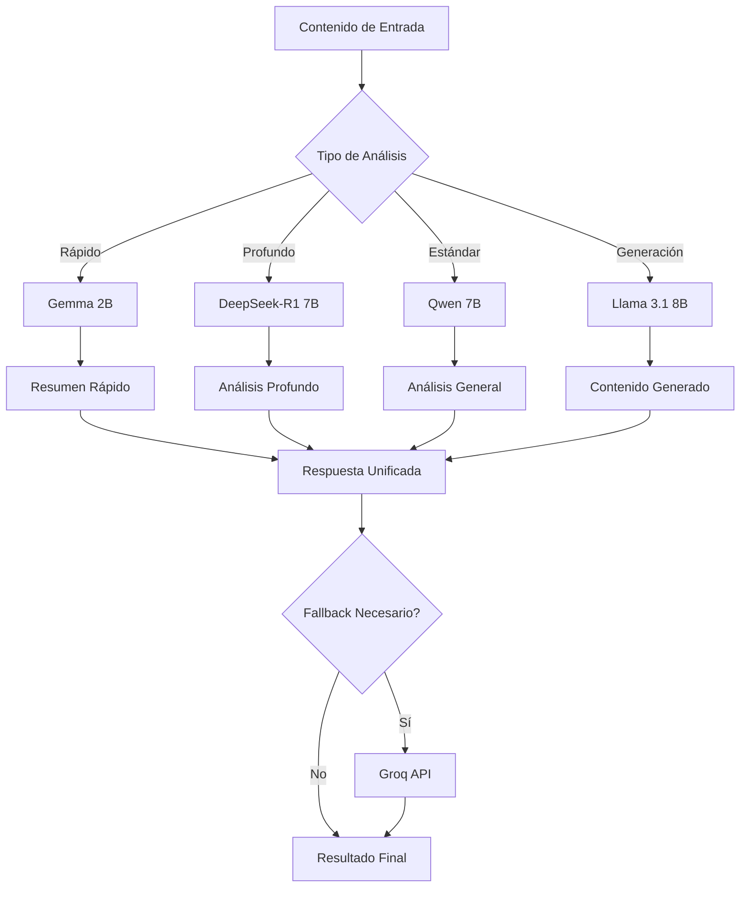

# 🧠 Integración de Ollama con DeepSeek-R1 y Gemma en RiskMap

## 📋 Resumen

RiskMap ahora incluye integración completa con **Ollama** para ejecutar modelos de IA localmente, incluyendo:

- 🧠 **DeepSeek-R1**: Para razonamiento profundo y análisis geopolítico avanzado
- ⚡ **Gemma 2**: Para procesamiento rápido y resúmenes eficientes  
- 🌍 **Qwen**: Para análisis multiidioma y tareas generales
- 📝 **Llama 3.1**: Para generación de texto y análisis estándar

## 🚀 Instalación Rápida

### 1. Instalar Ollama

**Windows:**
```bash
# Descargar desde: https://ollama.com/download/windows
# O usar el script automatizado:
python install_ollama.py
```

**Verificar instalación:**
```bash
ollama version
```

### 2. Instalar Modelos Recomendados

```bash
# Modelos principales (ejecutar en este orden)
ollama pull deepseek-r1:7b      # Análisis profundo (4.1GB)
ollama pull gemma2:2b           # Procesamiento rápido (1.6GB)
ollama pull qwen:7b             # Análisis general (4.1GB)

# Modelos adicionales (opcionales)
ollama pull llama3.1:8b         # Generación de texto (4.7GB)
ollama pull gemma2:9b           # Análisis avanzado (5.4GB)
ollama pull qwen2.5-coder:7b    # Tareas técnicas (4.1GB)
```

### 3. Configurar Variables de Entorno

```bash
# Agregar a .env
OLLAMA_BASE_URL=http://localhost:11434
OLLAMA_TIMEOUT=300
AI_PROVIDER_PRIORITY=ollama,groq
USE_LOCAL_AI=true
```

## 🔧 Uso del Sistema

### API Endpoints

#### Estado del Sistema
```bash
GET /api/ollama/status
```

Respuesta:
```json
{
  "success": true,
  "ollama_status": {
    "ollama": {
      "available": true,
      "models": ["deepseek-r1:7b", "gemma2:2b", "qwen:7b"],
      "base_url": "http://localhost:11434"
    },
    "capabilities": {
      "deep_reasoning": true,
      "fast_processing": true,
      "multilingual": true
    }
  }
}
```

#### Análisis Profundo con DeepSeek-R1
```bash
POST /api/ai/deep-analysis
Content-Type: application/json

{
  "content": "Texto a analizar...",
  "question": "¿Cuáles son las implicaciones geopolíticas?"
}
```

#### Resumen Rápido con Gemma
```bash
POST /api/ai/fast-summary
Content-Type: application/json

{
  "title": "Título del artículo",
  "content": "Contenido del artículo...",
  "max_words": 100
}
```

#### Análisis Unificado (Selección Automática)
```bash
POST /api/ai/unified-analysis
Content-Type: application/json

{
  "content": "Contenido a analizar...",
  "type": "deep",  // "standard", "deep", "fast"
  "prefer_local": true
}
```

### Uso Programático

```python
from src.ai.unified_ai_service import unified_ai_service
import asyncio

# Análisis geopolítico estándar
async def analyze_content():
    response = await unified_ai_service.analyze_geopolitical_content(
        content="Texto de noticia geopolítica...",
        prefer_local=True
    )
    
    if response.success:
        print(f"Análisis con {response.provider}: {response.content}")
        print(f"Metadatos: {response.metadata}")

# Resumen rápido
def quick_summary():
    response = unified_ai_service.generate_fast_summary(
        title="Título de la noticia",
        content="Contenido de la noticia...",
        max_words=150
    )
    
    return response.content

# Razonamiento profundo
async def deep_reasoning():
    response = await unified_ai_service.perform_deep_analysis(
        content="Contexto geopolítico...",
        question="¿Cuáles son las implicaciones a largo plazo?"
    )
    
    return response.metadata
```

## 🎯 Características de los Modelos

### DeepSeek-R1 🧠
- **Especialidad**: Razonamiento profundo y análisis complejo
- **Uso**: Análisis geopolítico avanzado, evaluación de riesgos
- **Ventajas**: Pensamiento crítico, análisis paso a paso
- **Modelos**: `deepseek-r1:7b`, `deepseek-r1:14b`

### Gemma 2 ⚡
- **Especialidad**: Procesamiento rápido y eficiente
- **Uso**: Resúmenes, clasificación rápida, tareas ligeras
- **Ventajas**: Velocidad, bajo consumo de recursos
- **Modelos**: `gemma2:2b`, `gemma2:9b`

### Qwen 🌍
- **Especialidad**: Análisis multiidioma y tareas generales
- **Uso**: Análisis de contenido internacional, programación
- **Ventajas**: Soporte multiidioma, versatilidad
- **Modelos**: `qwen:7b`, `qwen2.5-coder:7b`

### Llama 3.1 📝
- **Especialidad**: Generación de texto y análisis estándar
- **Uso**: Generación de contenido, análisis general
- **Ventajas**: Equilibrio entre calidad y velocidad
- **Modelos**: `llama3.1:8b`

## 🔄 Flujo de Trabajo del Sistema



## 🧪 Pruebas del Sistema

### Ejecutar Suite de Pruebas
```bash
python test_ollama_integration.py
```

### Pruebas Manuales

1. **Verificar Ollama**:
   ```bash
   ollama list
   ```

2. **Probar modelo específico**:
   ```bash
   ollama run deepseek-r1:7b "Explica la situación geopolítica actual"
   ```

3. **API de estado**:
   ```bash
   curl http://localhost:5000/api/ollama/status
   ```

## 📊 Requisitos del Sistema

### Mínimos
- **RAM**: 8GB (para modelos 2B-7B)
- **Almacenamiento**: 15GB libres
- **CPU**: 4 núcleos (recomendado)

### Recomendados
- **RAM**: 16GB+ (para modelos 7B-14B)
- **GPU**: NVIDIA con CUDA (opcional, acelera procesamiento)
- **Almacenamiento**: SSD para mejor rendimiento

### Espacio por Modelo
- `gemma2:2b`: ~1.6GB
- `deepseek-r1:7b`: ~4.1GB  
- `qwen:7b`: ~4.1GB
- `llama3.1:8b`: ~4.7GB
- `deepseek-r1:14b`: ~8.2GB

## 🔧 Configuración Avanzada

### Variables de Entorno Completas
```bash
# Configuración de Ollama
OLLAMA_BASE_URL=http://localhost:11434
OLLAMA_TIMEOUT=300
OLLAMA_MAX_RETRIES=3

# Configuración del servicio unificado  
AI_PROVIDER_PRIORITY=ollama,groq
USE_LOCAL_AI=true
PREFER_LOCAL_ANALYSIS=true

# Configuración de modelos por tarea
ANALYSIS_MODEL=deepseek-r1:7b
SUMMARY_MODEL=gemma2:2b
GENERATION_MODEL=llama3.1:8b
MULTILINGUAL_MODEL=qwen:7b
```

### Optimización de Rendimiento
```python
# En unified_ai_service.py
config = OllamaConfig(
    base_url="http://localhost:11434",
    timeout=600,  # Para análisis profundo
    temperature=0.2,  # Más determinista
    max_tokens=4000,
    top_p=0.9,
    top_k=40
)
```

## 🚨 Solución de Problemas

### Problemas Comunes

1. **Ollama no responde**:
   ```bash
   # Reiniciar servicio
   ollama serve
   ```

2. **Modelo no encontrado**:
   ```bash
   # Verificar modelos instalados
   ollama list
   
   # Instalar modelo faltante
   ollama pull deepseek-r1:7b
   ```

3. **Error de memoria**:
   - Usar modelos más pequeños (2B en lugar de 7B)
   - Cerrar aplicaciones innecesarias
   - Aumentar memoria virtual

4. **Timeout en análisis**:
   - Aumentar `OLLAMA_TIMEOUT` en .env
   - Usar modelos más rápidos para pruebas

### Logs y Debugging
```python
import logging
logging.getLogger('src.ai').setLevel(logging.DEBUG)
```

## 🔮 Próximas Características

- [ ] Integración con GPU para aceleración
- [ ] Caché inteligente de respuestas
- [ ] Modelos especializados por región geográfica
- [ ] Análisis en tiempo real con streaming
- [ ] Interfaz web para gestión de modelos
- [ ] Métricas de rendimiento por modelo

## 📚 Referencias

- [Ollama Documentation](https://ollama.com/docs)
- [DeepSeek-R1 Model Card](https://huggingface.co/deepseek-ai/DeepSeek-R1)
- [Gemma 2 Technical Report](https://arxiv.org/abs/2408.00118)
- [Qwen2.5 Documentation](https://qwenlm.github.io/blog/qwen2.5/)

---

## 🎉 ¡Sistema Listo!

Con esta integración, RiskMap ahora cuenta con capacidades de IA local avanzadas:

- 🔒 **Privacidad**: Análisis completamente local
- ⚡ **Velocidad**: Sin límites de API externa
- 🧠 **Inteligencia**: Modelos especializados por tarea
- 🔄 **Redundancia**: Fallback automático a Groq
- 📈 **Escalabilidad**: Agregar nuevos modelos fácilmente

¡El futuro del análisis geopolítico inteligente está aquí! 🚀
