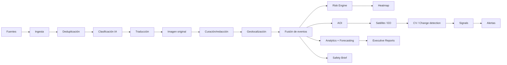
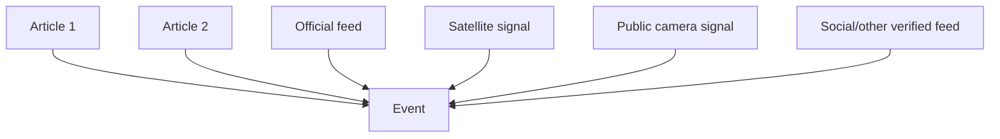
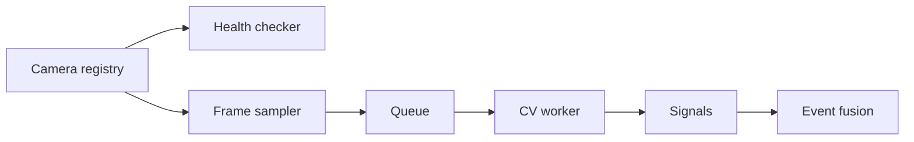
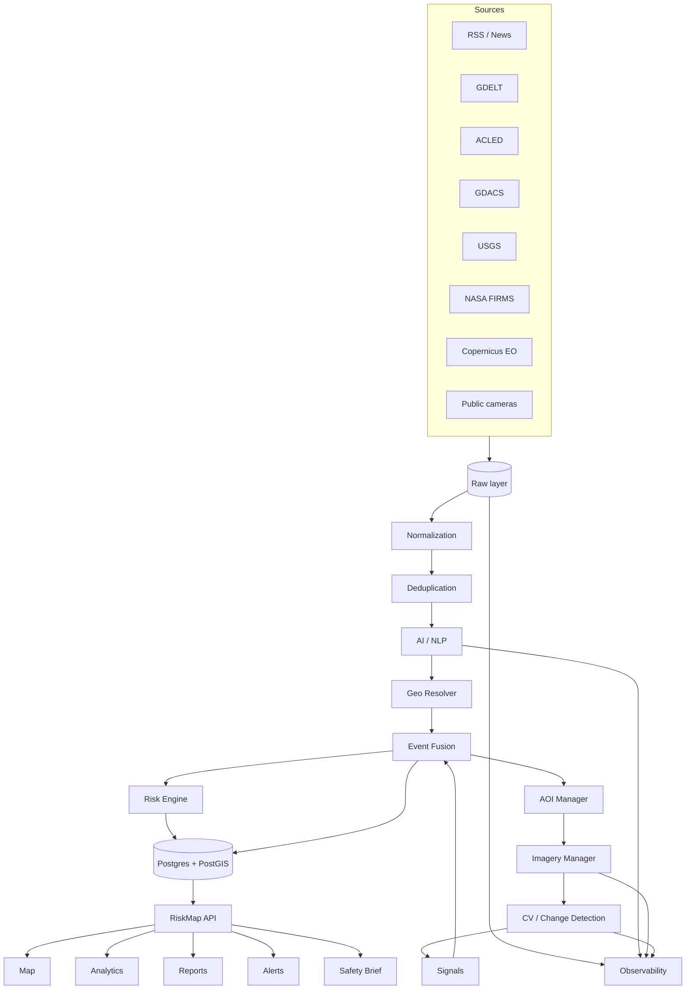

# RiskMap A.I. — Auditoría técnica, de datos, IA, CV, geoespacial y plan de evolución

**Fecha de auditoría:** 17 de agosto de 2026  
**Aplicación auditada:** https://riskmap-ai.vercel.app/  
**Repositorio:** https://github.com/AlfonsoCifuentes/riskmap  
**Objetivo del documento:** convertir RiskMap en un proyecto de portfolio técnicamente creíble, demostrable, reproducible y suficientemente completo como para funcionar como pieza central de un perfil Junior Data/AI con capacidad Full-Stack aplicada.

> **Instrucción para cualquier agente que use este documento (Claude Code, Codex u otro):**
> este documento es una base de trabajo, no una fuente infalible. Antes de implementar, vuelve a auditar el repositorio, el despliegue y las APIs externas. Si encuentras información nueva, contradicciones o mejoras, **añádelas** al documento bajo una sección claramente marcada como `Agent Independent Audit Addendum`; no borres, sustituyas ni reduzcas el contenido original. Después implementa los cambios por fases, con tests, criterios de aceptación y commits pequeños.

---

# 0. Conclusión ejecutiva

RiskMap tiene una idea de producto potente y un alcance poco habitual para un proyecto de portfolio: noticias, clasificación geopolítica, traducción, análisis de riesgo, geolocalización, mapas, imágenes, Computer Vision, datos satelitales, alertas, histórico y dashboards. El problema principal no es la falta de ideas. Es la distancia existente entre **capacidad declarada**, **capacidad implementada**, **capacidad actualmente operativa** y **capacidad demostrable**.

En su estado del 17 de agosto de 2026, el proyecto tiene una interfaz pública funcional y una base de datos que aún responde, pero el sistema no puede describirse rigurosamente como “tiempo real”:

- Los workflows programados de ingesta y de imagery/CV están desactivados por inactividad en GitHub Actions.
- La última ejecución del workflow de imágenes/CV terminó en fallo durante `Init schema`; adquisición de imágenes y YOLO ni siquiera llegaron a ejecutarse.
- La API pública devuelve como noticias más recientes elementos del **5 de marzo de 2026**.
- `/api/images?limit=200` devuelve actualmente **0 imágenes**.
- `/api/signals?limit=20` devuelve actualmente **0 señales**.
- El código de Sentinel-2 obtiene credenciales y busca productos, pero su función termina explícitamente en `return None`.
- La integración de NASA FIRMS genera una URL que omite el `MAP_KEY` que la API oficial exige actualmente.
- El modelo de CV principal es `yolov8n.pt` genérico de COCO; no constituye un detector especializado de tanques, edificios destruidos, humo, incendios, inundaciones, armas o desplazamientos.
- Parte del enriquecimiento NLP y traducción usa IDs de modelos Groq que están retirados o que han alcanzado fecha de apagado.
- El “risk score” actual es principalmente un score heurístico de palabras clave, no un modelo de riesgo validado.
- La geolocalización depende en gran medida de diccionarios de ciudades/países y coordenadas de capitales/centroides, por lo que la precisión aparente puede ser mucho mayor que la real.
- Hay divergencia entre `master`, una rama `copilot/vercel-deployment-optimizations`, y lo que realmente está desplegado en producción.
- El CI del branch principal está rojo.
- Existe una arquitectura modular en `src/`, pero convive con `RISKMAP.py`, un monolito legado de aproximadamente 786 KB, además de un `.venv` ya versionado en el histórico del repositorio.
- El README actual no explica adecuadamente la arquitectura ni demuestra el proyecto.

La prioridad no debe ser añadir veinte páginas nuevas. La prioridad es convertir las capacidades existentes en un sistema **honesto, observable, medible y reproducible**.

La transformación recomendada se resume así:

```text
ANTES
muchas capacidades declaradas
    ↓
varias implementaciones parciales
    ↓
estado real difícil de conocer
    ↓
demo dependiente de proveedores externos
    ↓
recruiter ve amplitud, pero puede detectar inconsistencias

DESPUÉS
pipeline observable y versionado
    ↓
eventos fusionados con evidencia y precisión geoespacial
    ↓
riesgo separado de confianza
    ↓
satélite real para señales compatibles con su resolución
    +
Replay Mode con datasets de alta resolución para CV
    ↓
dashboards, forecasting, alertas y Safety Brief
    ↓
cada afirmación tiene fuente, timestamp, modelo y métricas
```

No existe una modificación que garantice que “cualquier recruiter contrate inmediatamente”. Sí existe una estrategia para convertir RiskMap en una demostración extraordinariamente fuerte de Data Engineering, Data Analysis, Applied AI, Computer Vision, geospatial analytics, MLOps y Full-Stack: **hacer que cada capacidad se pueda verificar**.

---

# 1. Estado auditado a 17/08/2026

## 1.1 Aplicación pública

La URL pública responde correctamente:

- `https://riskmap-ai.vercel.app/`
- Frontend actual: HTML/CSS/JS estático servido en Vercel.
- API: funciones Python serverless bajo `/api`.
- Base de datos: Neon/Postgres mediante la capa `api/_db.py`.
- Visualización: Leaflet/leaflet.heat y Chart.js en varias páginas.

Páginas públicas relevantes detectadas:

- Análisis de Noticias
- Monitor de Conflictos
- Análisis de Tendencias
- Alertas Tempranas
- Reportes Ejecutivos
- Inteligencia de Datos
- Análisis Satelital
- Vigilancia por Video
- Análisis Histórico
- Logs
- Settings
- About

Esto ya da una buena superficie de producto, pero varias pantallas deben clasificarse con estados explícitos:

- `LIVE`
- `DEGRADED`
- `REPLAY`
- `EXPERIMENTAL`
- `OFFLINE`
- `NO DATA`

Nunca debería mostrarse “operacional” simplemente porque el endpoint devuelve HTTP 200.

---

## 1.2 Frescura actual

El endpoint:

```text
GET /api/articles?limit=5
```

ordena por `published_at.desc`.

El 17/08/2026, los elementos más recientes devueltos tienen fecha **05/03/2026**.

Esto implica que:

```text
HTTP API saludable ≠ pipeline saludable
base de datos accesible ≠ datos frescos
estadísticas disponibles ≠ monitorización en tiempo real
```

Añadir un concepto de **freshness SLA**:

| Nivel | Condición orientativa |
|---|---|
| Healthy | última ingesta < 3 h |
| Warning | 3–8 h |
| Degraded | 8–24 h |
| Stale | > 24 h |
| Offline | pipeline sin ejecución / error |

En producción debe aparecer siempre:

```json
{
  "pipeline": {
    "status": "stale",
    "last_successful_ingest_at": "...",
    "last_successful_enrichment_at": "...",
    "last_successful_imagery_at": "...",
    "last_successful_cv_at": "...",
    "latest_article_published_at": "...",
    "deployment_sha": "...",
    "data_age_seconds": 0
  }
}
```

---

## 1.3 GitHub Actions

### Ingesta

`.github/workflows/ingest.yml`

Configuración declarada:

```text
cada 2 horas
→ schema_init
→ src.pipeline.ingest
→ src.pipeline.enrich
→ retention
```

Estado auditado:

```text
state = disabled_inactivity
```

Última ejecución programada observada:

```text
4 de mayo de 2026
resultado = success
```

GitHub documenta que los workflows programados de repositorios públicos pueden deshabilitarse automáticamente tras 60 días sin actividad. Una vez inhabilitados, no debe asumirse que una modificación posterior los haya reactivado automáticamente.

### Imagery + CV

`.github/workflows/imagery.yml`

Pipeline declarado:

```text
cada 6 horas
→ schema_init
→ acquire_images
→ detect
→ retention
```

Estado auditado:

```text
state = disabled_inactivity
```

Última ejecución:

```text
5 de mayo de 2026
resultado = failure
fallo = "Init schema"
Acquire free imagery = skipped
Run CV detection = skipped
Retention cleanup = skipped
```

Los logs de esa ejecución ya no están disponibles en GitHub (HTTP 410), por lo que el error exacto debe reproducirse en una rama de reparación.

### CI

El último CI observado para `master` falló en:

```text
Install dependencies
```

Como consecuencia:

```text
flake8 = skipped
pytest = skipped
black = skipped
mypy = skipped
coverage = skipped
```

Un recruiter técnico que abre GitHub puede interpretar un badge rojo como señal de proyecto no mantenido. P0: **hacer verde CI antes de añadir features**.

---

# 2. Estado de ramas y despliegue

## 2.1 Branch principal

Branch por defecto:

```text
master
```

HEAD observado durante la auditoría:

```text
35743514b830325a3ad1cb9c8362487be07508b5
```

Existe una rama relevante:

```text
copilot/vercel-deployment-optimizations
```

que está divergida respecto a `master`.

Contiene, entre otras cosas:

- optimizaciones de Vercel;
- cambios en API;
- `api/gdelt-events.py`;
- `api/pipeline-status.py`;
- `src/pipeline/run_pipeline.py`;
- cambios de ingest/enrich/detect;
- mejoras de i18n.

No debe hacerse un merge ciego.

### Estrategia recomendada

1. Crear una rama nueva desde `master`, por ejemplo:

```text
feat/riskmap-v2-recovery
```

2. Auditar la rama Copilot.
3. Extraer únicamente cambios válidos.
4. Reescribir los componentes que usen modelos/API obsoletos.
5. Incorporar tests.
6. Abrir PR.
7. Verificar preview en Vercel.
8. Fusionar.
9. Verificar producción contra el SHA exacto.

---

## 2.2 Producción

La inspección de Vercel muestra que la URL pública está sirviendo una producción basada en una versión antigua de `master`, mientras que las modificaciones posteriores de junio aparecen como previews de la rama de optimización.

Problema:

```text
Código actual del repo
        ≠
rama experimental
        ≠
producción
```

P0: introducir trazabilidad de build.

En `/api/status`:

```json
{
  "deployment": {
    "git_sha": "...",
    "branch": "master",
    "built_at": "...",
    "environment": "production"
  }
}
```

Y en el footer/About:

```text
Build: 3f91c2e
Data updated: 12 min ago
Pipeline: HEALTHY
```

Esto aporta mucha credibilidad.

---

# 3. Auditoría del pipeline real

El pipeline conceptual deseado es correcto como dirección:



Sin embargo, el pipeline real actual se aproxima más a:

```text
RSS + NewsAPI
    ↓
almacenamiento
    ↓
filtro heurístico
    ↓
score heurístico por keywords
    ↓
tipo de conflicto por keywords
    ↓
sentimiento muy simple
    ↓
geolocalización por diccionarios
    ↓
resumen LLM limitado
    ↓
traducción
    ↓
eventos agrupados de forma gruesa
    ↓
heatmap
```

y, en paralelo:

```text
AOI/event location
    ↓
GIBS / FIRMS / Sentinel incompleto
    ↓
images
    ↓
YOLOv8n genérico
    ↓
detections/signals
```

La segunda rama está actualmente vacía en producción.

---

# 4. Auditoría etapa por etapa

## 4.1 Ingesta de noticias

### Lo que existe

`src/pipeline/ingest.py` recoge fuentes RSS y NewsAPI.

Se observaron fuentes como:

- Al Jazeera
- BBC
- NYT World
- Reuters
- The Guardian
- Defense News
- Janes
- Crisis Group
- Brookings
- Carnegie
- ReliefWeb
- GDACS
- Middle East Eye
- SCMP

Además de búsquedas NewsAPI.

### Problemas

#### 1. Estado programado apagado

La ingesta no está ocurriendo regularmente.

#### 2. Deduplicación insuficiente

La URL idéntica no basta.

Un mismo incidente puede producir:

```text
Reuters URL A
BBC URL B
NYT URL C
Al Jazeera URL D
```

y terminar como cuatro “riesgos”, inflando el heatmap.

### Objetivo

Separar:

```text
Article
≠
Event
```

Un artículo es evidencia.  
Un evento es el incidente real.

### Modelo recomendado

```text
raw_sources
raw_articles
canonical_articles
article_embeddings
events
event_evidence
event_locations
```

### Deduplicación multicapa

1. canonical URL;
2. URL normalization;
3. title normalized hash;
4. SimHash/MinHash;
5. embedding cosine similarity;
6. ventana temporal;
7. proximidad geográfica;
8. coincidencia de actores/entidades.

### Criterio de aceptación

Un incidente cubierto por diez periódicos debe:

- seguir mostrando sus diez fuentes;
- generar **un único evento principal** salvo que existan subeventos reales;
- aumentar `source_count` y `confidence`, no multiplicar artificialmente la densidad.

---

# 4.2 Clasificación por IA

Actualmente existe una mezcla de:

- keywords;
- reglas;
- heurísticas;
- llamadas LLM.

No debe llamarse “clasificación IA” a todo por igual.

Crear columnas:

```text
classification_method
classifier_name
classifier_version
classifier_confidence
classification_evidence
```

Ejemplo:

```json
{
  "category": "armed_conflict",
  "subtype": "airstrike",
  "method": "llm_structured",
  "model": "provider/model-version",
  "confidence": 0.87,
  "evidence": ["airstrike", "military target", "casualties"]
}
```

### Taxonomía sugerida

```text
conflict
  armed_conflict
  terrorism
  civil_unrest
  coup
  interstate_tension
  sanctions
  cyber
  humanitarian

disaster
  earthquake
  tsunami
  flood
  wildfire
  tropical_cyclone
  tornado
  volcano
  landslide
  drought
  extreme_weather

security
  infrastructure
  maritime
  aviation
  nuclear
```

No mezclar `risk level` y `category`.

---

# 4.3 Traducción

Existe traducción a español mediante Groq.

Problema fundamental: el pipeline sobrescribe `title` y `summary`.

### Nuevo esquema

```text
title_original
summary_original
content_original
language_original

title_es
summary_es
content_es

translation_model
translation_version
translation_created_at
translation_quality_score
```

Nunca perder el original.

### Model routing

No hard-codear:

```python
model="llama-..."
```

dentro de lógica de negocio.

Crear:

```text
src/ai/provider.py
src/ai/model_registry.py
```

Ejemplo conceptual:

```python
AI_TASKS = {
    "classification": "RISKMAP_MODEL_CLASSIFIER",
    "translation": "RISKMAP_MODEL_TRANSLATOR",
    "summarization": "RISKMAP_MODEL_SUMMARIZER",
    "geocoding_assist": "RISKMAP_MODEL_GEO",
}
```

Añadir test startup:

```text
GET provider model list
→ validar que modelos configurados existen
→ si no, fail fast y marcar pipeline DEGRADED
```

## Bloqueo actual importante

Se detectan en código:

```text
llama-3.1-70b-versatile
llama-3.1-8b-instant
```

El primero llevaba retirado desde 2025. El segundo alcanzó fecha de apagado para tiers free/developer el **16 de agosto de 2026** según Groq.

La rama experimental de CV usa:

```text
llama-3.2-11b-vision-preview
```

retirado desde abril de 2025.

Por tanto, incluso reactivando cron, varios pasos IA pueden romperse.

---

# 4.4 Obtención de imagen original

`api/_og_image.py` tiene una estrategia razonable:

1. OG image directa;
2. Twitter image;
3. JSON-LD;
4. iFramely;
5. Microlink fallback.

Esto puede conservarse, pero debe salir del request web y pasar a un worker.

## Problema de seguridad crítico

El módulo construye un contexto SSL con:

```python
check_hostname = False
verify_mode = CERT_NONE
```

Esto elimina verificación TLS.

P0:

- reactivar validación TLS;
- no desactivar certificados globalmente;
- si una fuente falla, registrar fallo;
- nunca resolverlo anulando seguridad.

## Riesgo SSRF

El backend descarga URLs procedentes de artículos.

Debe impedir:

- `localhost`;
- `127.0.0.0/8`;
- IP privadas;
- link-local;
- metadata endpoints cloud;
- redirecciones a IP internas;
- protocolos no HTTP(S).

### Pipeline seguro

```text
URL
↓
normalize
↓
DNS resolve
↓
reject private/local addresses
↓
HEAD / GET limited
↓
follow redirects with validation
↓
validate Content-Type
↓
max bytes
↓
decode image
↓
quality checks
↓
logo/watermark detection
↓
storage
```

---

# 4.5 Detector de logotipos / watermarks

La heurística actual rechaza URLs que contienen palabras como `logo`, pero no analiza píxeles.

No recomiendo “borrar logos”. Es mejor evitar imágenes con marca o seleccionar otra imagen. Borrar un watermark puede ser problemático y, además, elimina trazabilidad.

## Pipeline recomendado

### Nivel 1 — barato

- dimensiones;
- aspect ratio;
- entropy;
- tamaño mínimo;
- detectar banners;
- URL lexical filters.

### Nivel 2 — OCR / watermark

Inspeccionar:

- esquinas;
- banda inferior;
- textos repetidos;
- nombres de medios.

Guardar:

```text
watermark_detected
watermark_text
watermark_confidence
watermark_bbox
```

### Nivel 3 — logo detector

Posibles estrategias:

- detector específico de logos;
- embeddings CLIP contra biblioteca de logos de fuentes;
- template matching para fuentes conocidas.

### Política

```text
logo found
    ↓
buscar alternate image
    ↓
si no existe
mostrar original con atribución
    ↓
no fingir que es una imagen propia
```

---

# 4.6 “Redacción de la noticia”

Actualmente hay resumen IA, pero no existe claramente una capa editorial robusta equivalente a la capacidad que la UI sugiere como “Reescritura”.

No crear noticias nuevas como si fueran originales de RiskMap sin trazabilidad.

### Producto recomendado: `Risk Brief`

En lugar de “reescritura”:

```text
Risk Brief
```

Estructura:

```markdown
## Qué ha ocurrido
2–4 frases factuales.

## Dónde
Lugar + precisión estimada.

## Actores
Entidades identificadas.

## Por qué importa
Impacto contextual.

## Riesgo estimado
Score + nivel + factores.

## Incertidumbre
Qué no está confirmado.

## Fuentes
3–N fuentes corroboradas.
```

Cada afirmación importante debería poder vincularse a evidencia.

Esto es mucho más impresionante que un simple paraphrase LLM.

---

# 4.7 Risk Engine

El score actual se basa principalmente en peso de palabras clave:

```text
missile → +3
conflict → +2
diplomatic → +1
...
```

Después se normaliza.

Esto puede llamarse:

```text
text severity signal
```

pero no debe presentarse como probabilidad real de conflicto.

## Modelo objetivo

Separar:

### A. Hazard / Severity

¿Qué tan severo es el incidente?

### B. Probability / Escalation

¿Qué probabilidad existe de escalada en un horizonte?

### C. Exposure

¿Cuántas personas/infraestructuras están expuestas?

### D. Vulnerability

¿Qué tan vulnerable es la zona?

### E. Confidence

¿Qué tan fiable es la evidencia?

No mezclar Confidence con Risk.

Ejemplo conceptual:

```text
risk_score =
  f(
    severity,
    escalation_probability,
    exposure,
    vulnerability
  )

confidence_score =
  f(
    independent_source_count,
    source_quality,
    geolocation_quality,
    recency,
    model_agreement
  )
```

### UI

```text
Risk: 82/100 HIGH
Confidence: 61/100 MEDIUM
```

Esto evita comunicar un “82% de probabilidad” cuando el número no significa eso.

---

# 4.8 Geolocalización

Este es uno de los puntos que más necesita mejora.

## Estado actual

Se usan diccionarios estáticos de países y ciudades.

Ejemplos:

```text
Israel → Jerusalén
Iran → Teherán
Ukraine → centro aproximado del país
```

Eso hace que muchas noticias distintas se superpongan en la misma coordenada.

## Consecuencia

El heatmap puede convertirse en:

```text
media attention map
```

más que:

```text
risk location map
```

## Nuevo geospatial resolver

### Paso 1 — extracción de entidades

Obtener:

- GPE;
- LOC;
- instalaciones;
- aeropuertos;
- puertos;
- regiones;
- carreteras;
- fronteras;
- coordenadas explícitas.

### Paso 2 — candidatos

Para cada entidad:

```text
name
candidate coords
country
admin hierarchy
feature type
```

### Paso 3 — contexto

Resolver ambigüedad usando:

- país del artículo;
- entidades relacionadas;
- evento previo;
- coordenadas de fuente externa;
- proximidad temporal;
- headline;
- body.

### Paso 4 — fuentes autoritativas

Prioridad sugerida:

```text
fuente de evento con coordenada explícita
> fuente oficial
> múltiples fuentes concordantes
> geocoder
> LLM-assisted disambiguation
> capital/centroide fallback
```

### Paso 5 — incertidumbre

Guardar:

```text
latitude
longitude
geometry
geo_method
geo_precision_m
geo_confidence
geo_is_fallback
geo_candidates_json
```

Si solo sabemos “Ukraine”:

```text
precision = country
geo_confidence = low
```

No mostrar un punto de falsa precisión.

### Base de datos

Recomendado:

- Postgres
- PostGIS
- H3 para agregación

---

# 4.9 Event Fusion

Esta es probablemente la mejora de arquitectura más valiosa de toda RiskMap.

Actualmente el sistema está centrado en artículos.

Debe pasar a estar centrado en eventos.



Un evento debería almacenar:

```text
event_id
canonical_title
event_type
event_subtype
started_at
last_updated_at
status
geometry
severity
risk
confidence
source_count
evidence_count
actor_count
affected_population
```

Tabla puente:

```text
event_evidence
```

con:

```text
event_id
evidence_type
article_id / external_event_id / image_id / detection_id
source
source_url
published_at
trust_weight
```

Esto hace posible explicar:

> “¿Por qué RiskMap dice que esta zona tiene riesgo alto?”

---

# 4.10 Heatmap

## Estado actual

`/api/heatmap` devuelve objetos como:

```json
{
  "lat": 31.77,
  "lon": 35.21,
  "weight": 0.7,
  "source": "event"
}
```

Problemas:

- sin nombre;
- sin categoría;
- sin subtype;
- sin risk level;
- sin `event_id`;
- sin precisión;
- sin confidence;
- sin timestamp;
- sin source count;
- sin tooltip adecuado;
- `limit` no limita realmente el conjunto total porque se aplica solo a parte de las consultas;
- eventos reciben un peso fijo de 0.7 en una rama del endpoint.

## API objetivo

Preferible GeoJSON:

```json
{
  "type": "Feature",
  "id": "evt_123",
  "geometry": {
    "type": "Point",
    "coordinates": [35.21, 31.77]
  },
  "properties": {
    "name": "Escalada en ...",
    "category": "conflict",
    "subtype": "armed_conflict",
    "risk_score": 0.82,
    "risk_level": "high",
    "confidence": 0.71,
    "geo_precision_m": 8000,
    "source_count": 6,
    "updated_at": "..."
  }
}
```

## Filtros

- All
- Armed conflict
- Geopolitical tension
- Civil unrest
- Terrorism
- Humanitarian
- Earthquake
- Flood
- Wildfire
- Tropical cyclone
- Volcano
- Other disaster

Añadir:

- rango temporal;
- risk minimum;
- confidence minimum;
- source;
- país/región;
- only corroborated;
- live/replay.

## Hover

Cuando el usuario pasa el ratón:

```text
Nombre
Tipo
Ubicación
Risk
Confidence
Última actualización
Nº fuentes
```

Click:

```text
abre Event Intelligence Panel
```

## Tecnología

Leaflet puede seguir funcionando.

Para una demo visual más avanzada:

- MapLibre GL;
- deck.gl;
- H3 HexagonLayer;
- HeatmapLayer;
- ScatterplotLayer;
- GeoJsonLayer.

No es obligatorio migrar inmediatamente; primero corregir datos.

---

# 5. Satélite: qué puede y qué no puede hacerse

Aquí conviene ser especialmente riguroso.

## 5.1 Sentinel-2 no es un detector razonable de tanques

Sentinel-2 ofrece bandas visibles/NIR a **10 m por píxel**.

Un vehículo militar individual puede ocupar aproximadamente uno o pocos píxeles o menos dependiendo de dimensiones/orientación.

Por tanto, afirmar:

```text
Sentinel-2 → YOLO → tanque individual
```

no sería una demostración técnicamente convincente.

Sentinel-2 sí es muy útil para:

- incendios;
- cicatrices de incendio;
- inundaciones a escala suficiente;
- cambios de vegetación;
- alteraciones del terreno extensas;
- destrucción urbana agregada;
- humo/nubes en ciertos contextos;
- índices espectrales;
- comparativas before/after;
- detección de cambios.

## 5.2 Sentinel-1

Añadir Sentinel-1 SAR para:

- inundaciones;
- cambios superficiales;
- observación con nubes;
- análisis nocturno;
- ciertos cambios estructurales amplios.

Un “EO Fusion” Sentinel-1 + Sentinel-2 sería una muy buena demostración Data/AI.

---

# 6. Auditoría de `acquire_images.py`

## 6.1 GIBS

Existe descarga de mosaicos/tiles NASA GIBS.

Pero actualmente se solicitan resoluciones que son adecuadas para contexto global, no para objetos militares.

Úsalo para:

- incendios;
- grandes fenómenos;
- contexto EO.

## 6.2 FIRMS

El código actual construye un endpoint del estilo:

```text
/api/area/csv/VIIRS_SNPP_NRT/...
```

La API oficial actual requiere:

```text
/api/area/csv/[MAP_KEY]/[SOURCE]/[AREA]/[DAY_RANGE]
```

El `MAP_KEY` es gratuito, pero requerido.

### Fix

Variable:

```text
NASA_FIRMS_MAP_KEY
```

y test contractual contra API.

No ejecutar integración real en CI en cada push; mockearla y crear job manual de smoke.

## 6.3 Sentinel-2

La función actual:

- obtiene OAuth;
- busca Sentinel-2;
- consulta producto;
- acaba en:

```python
return None
```

Esto es un bloqueo de implementación.

### Recomendación

En lugar de construir manualmente nodos de productos:

**Opción recomendada:** CDSE Sentinel Hub Process API.

Pipeline:

```text
AOI bbox
+ time interval
+ cloud filter
↓
Catalog/STAC
↓
selección adquisición
↓
Process API
↓
GeoTIFF / PNG
↓
object storage
↓
metadata DB
```

La documentación oficial de CDSE ya ofrece STAC y Process API.

---

# 7. Nueva estrategia Satellite / EO

Crear dos modos claramente distintos.

## 7.1 `LIVE EO MODE`

Usa datos abiertos reales.

### Fuentes

- Copernicus Data Space / Sentinel-1
- Copernicus Data Space / Sentinel-2
- NASA FIRMS
- NASA GIBS
- USGS
- GDACS

### Casos

- wildfire;
- flood;
- earthquake context;
- cyclone context;
- large-scale damage/change;
- AOI monitoring.

### Output

```text
EO Observation
```

con:

```text
sensor
product_id
captured_at
cloud_cover
resolution
bbox
bands
provider
license
processing_recipe
```

---

## 7.2 `CV REPLAY / BENCHMARK MODE`

Para demostrar tanques, vehículos, daños y objetos que requieren alta resolución.

Esto debe aparecer claramente como:

```text
REPLAY / BENCHMARK
```

no como stream live.

### Datasets recomendados

#### xView

Imagery de alta resolución (~0.3 m GSD en el dataset original) y gran cantidad de objetos anotados.

Ideal para:

- vehículos;
- aeronaves;
- barcos;
- edificios y otras clases overhead.

#### xBD / xView2

Excelente para:

- before/after;
- edificios dañados;
- disaster damage;
- fuego/agua/humo en anotaciones relacionadas.

#### SpaceNet

Para:

- edificios;
- carreteras;
- change detection;
- inundaciones según challenge/dataset.

### Demo UX

```text
Scenario:
Hurricane / Urban Damage

[ BEFORE ] [ AFTER ]

Model detections
Building damage: 74
Flooded roads: 12
Fire/smoke indicators: 4

Precision: ...
Recall: ...
F1: ...
IoU: ...

Dataset: xBD
Model version: ...
```

Esto es muchísimo más defendible que simular una API satelital “live”.

---

# 8. Datos sintéticos

El usuario propuso datos sintéticos como fallback. Sí, pero con reglas.

## Úsalos para

- tests;
- UI;
- stress tests;
- geometries;
- signal generation;
- edge cases;
- demos de pipeline.

## No los uses para

- demostrar “mAP real”;
- fingir imágenes satelitales;
- declarar detección de tanques real;
- presentar accuracy de producción.

Todo fixture:

```text
synthetic = true
```

y UI:

```text
DEMO DATA
```

### Excelente idea de portfolio

Crear `scenario packs`:

```text
scenarios/
  wildfire_portugal/
  flood_valencia/
  earthquake_turkey/
  conflict_overhead_xview/
```

Cada pack:

```text
manifest.json
articles/
events.json
imagery/
ground_truth/
expected_pipeline.json
```

Esto permite ejecutar la demo sin depender de APIs.

---

# 9. Computer Vision

## 9.1 Estado actual

`detect.py` usa:

```python
YOLO("yolov8n.pt")
```

Modelo COCO estándar.

Puede detectar categorías genéricas como:

- person;
- car;
- truck;
- bus;
- airplane;
- boat.

No convierte automáticamente eso en:

- tanque;
- APC;
- arma;
- edificio bombardeado;
- humo;
- inundación.

El código intenta mapear keywords de clases que el modelo genérico no produce.

También incluye una heurística:

```text
3+ trucks/airplanes → posible conflict
```

Esto puede generar falsos positivos graves.

## 9.2 Arquitectura CV objetivo

Separar modelos por tarea.

### `object_detection_overhead`

- vehículos;
- aeronaves;
- barcos;
- objetos militares cuando exista dataset adecuado.

### `building_damage`

- intact;
- minor;
- major;
- destroyed.

### `flood_segmentation`

- flooded building;
- flooded road;
- water extent.

### `fire_smoke`

- fire;
- smoke;
- plume.

### `change_detection`

```text
before + after
→ changed area mask
```

### `crowd/displacement`

Ser extremadamente cuidadoso.

Detectar:

```text
crowd density / large groups
```

no afirmar automáticamente:

```text
mass migration
```

La migración es una interpretación contextual, no una clase visual directa.

---

# 10. Métricas CV

Cada modelo debe tener:

```text
dataset
split
model version
training date
precision
recall
F1
mAP50
mAP50-95
IoU / Dice si segmentation
confusion matrix
```

Añadir página:

```text
Model Lab
```

con:

```text
Model Registry
Benchmark Runs
Dataset Provenance
Failure Cases
```

Esto mejora muchísimo el valor para recruiters.

---

# 11. VLM / Vision LLM

La rama Copilot añade VLM como fallback.

La idea puede ser útil, pero no como sustituto de un detector validado.

### Uso recomendado

VLM:

- describe escena;
- ayuda a triage;
- genera explicación;
- propone tags;
- cruza señales.

No usar:

```text
"confidence": 0.87
```

autodeclarado por el LLM como si fuera probabilidad calibrada.

Etiquetar:

```text
vlm_assessment
```

separado de:

```text
detector_output
```

---

# 12. Public Cameras / CCTV

## Estado actual

La página de video consulta registros de `images` y `signals`.

No existe evidencia de un servicio sólido de captura continua actual.

Un Vercel Function tampoco es el lugar apropiado para mantener RTSP/HLS persistente.

## Arquitectura



### `camera_registry`

```text
id
name
operator
country
lat
lon
protocol
public_url
license
terms_checked_at
active
last_seen
sampling_policy
```

### Frame sampling

No procesar necesariamente 30 FPS.

Por ejemplo:

```text
1 frame / 10 sec
```

para smoke/flood/blocked road.

### Privacidad

No implementar identificación facial.

Si se almacenan frames:

- blur/anonymization;
- retention corta;
- guardar signals más tiempo que frames.

### Detecciones útiles

- smoke/fire;
- flood;
- road obstruction;
- debris;
- crowd density;
- extreme weather visibility;
- infrastructure damage.

---

# 13. Histórico

La página actual de histórico carga hasta 300 artículos y construye una serie temporal por mes.

Eso no es aún una verdadera base de conflictos históricos.

## Upgrade

Crear:

```text
Historical Conflict Explorer
```

Fuentes potenciales compatibles con sus términos:

- ACLED;
- UCDP;
- GDELT Event data;
- EM-DAT / GDACS para desastres;
- USGS histórico;
- NOAA/IBTrACS para ciclones.

### Funciones

- timeline;
- mapa temporal;
- event density;
- fatalities/impact cuando la fuente lo permita;
- duration;
- recurrence;
- actor network;
- before/after;
- compare countries;
- compare event types.

### Valor Data Analyst

Aquí es donde RiskMap puede demostrar de verdad:

- SQL;
- time series;
- cohorts/geospatial aggregation;
- KPIs;
- segmentation;
- trends;
- anomaly detection;
- forecasting.

---

# 14. Analytics Dashboard

La pantalla actual de tendencias genera parte de la serie temporal en cliente a partir de un máximo de artículos recuperados.

Debe convertirse en un backend analítico real.

## KPI layer

### Pipeline KPIs

```text
articles_ingested_24h
articles_processed_24h
dedupe_ratio
classification_success_rate
translation_success_rate
geolocation_success_rate
geo_high_precision_rate
pipeline_latency_p50/p95
stale_events
failed_sources
```

### Intelligence KPIs

```text
active_events
new_events_24h
high_risk_events
critical_events
events_by_category
events_by_region
risk_delta_24h
risk_delta_7d
corroboration_ratio
median_source_count
```

### CV KPIs

```text
images_processed
detections
signals
precision
false_positive_rate
model latency
detections_by_class
```

### Source quality

```text
source_uptime
articles/source
duplicate_rate/source
image_success/source
geo_resolution/source
```

---

# 15. Data Quality Dashboard

Añadir una sección específica.

Esto puede ser especialmente útil para roles Data Analyst/Data Quality.

Métricas:

```text
null rate
duplicate rate
schema failures
invalid dates
invalid coordinates
country-coordinate mismatch
risk outliers
stale records
broken URLs
missing provenance
untranslated records
unclassified records
```

### Quality Score

```text
Completeness
Validity
Uniqueness
Consistency
Timeliness
Provenance
```

Mostrar score por dataset y fuente.

---

# 16. Forecasting / Early Warning

No venderlo como “IA predice guerras”.

Nombre mejor:

```text
Escalation Forecasting / Early Warning
```

## Horizontes

- 24 h
- 7 d
- 30 d

## Target

Ejemplos:

```text
P(event escalation in 7d)
P(new violent event in cell H3)
P(disaster impact severity ≥ threshold)
```

## Baselines obligatorios

Antes de deep learning:

- historical mean;
- moving average;
- logistic regression;
- gradient boosting.

### Features

```text
event_count rolling 1/3/7/30d
risk mean
risk slope
source count
cross-source agreement
actor count
nearby event density
historical recurrence
official warning level
FIRMS/USGS/GDACS features
weather/hazard features
```

## Validación

Nunca random split.

Usar:

```text
train = pasado
validation = periodo posterior
test = futuro posterior
```

Métricas:

- Brier Score;
- ROC-AUC;
- PR-AUC;
- Precision@K;
- Recall@K;
- calibration plot.

### UI

```text
7-day escalation probability: 34%
Confidence: medium
Baseline: 21%
Main drivers:
  + event frequency
  + source corroboration
  + official alert
```

---

# 17. Disaster Forecasting

Diferenciar:

```text
forecast de peligro
```

de:

```text
predicción ML propia
```

Si NOAA/GDACS/USGS ya tienen información oficial mejor que un modelo casero, usarla.

El valor de RiskMap está en:

```text
fusionar + contextualizar + visualizar
```

no en reemplazar agencias científicas.

---

# 18. Alertas

La página “Early Warning” actual lista eventos de alto riesgo. No es todavía un sistema de notificaciones.

## Modelo de usuario

```text
subscriptions
notification_channels
notification_deliveries
notification_preferences
```

### Subscription

```text
user_id
geometry / radius
categories
min_risk
min_confidence
channels
quiet_hours
```

## Trigger

```text
new event
OR risk crosses threshold
OR confidence increases materially
OR official alert
OR event enters user geofence
```

### Antispam

Fingerprint:

```text
(event_id + state_change + threshold)
```

Cooldown y deduplicación.

## Canales

### PWA / Web Push

Muy buena opción de portfolio.

### Email

- Resend;
- Postmark;
- otro proveedor equivalente.

### SMS

Opcional por coste:

- Twilio o equivalente.

No convertir SMS en requisito para MVP.

### Historial

```text
sent
delivered
opened
acknowledged
failed
```

---

# 19. “Me afecta este evento”

Excelente oportunidad de producto.

Añadir:

```text
Safety Brief
```

## Contenido

### Estado

```text
Distance to event
Risk
Confidence
Last update
Official alert level
```

### “Qué hacer”

Debe separar visualmente:

```text
OFFICIAL GUIDANCE
```

de:

```text
RISKMAP CONTEXT
```

No inventar órdenes de evacuación.

Fuentes:

- autoridades nacionales;
- protección civil;
- GDACS;
- organismos meteorológicos;
- USGS;
- UN / Red Cross según evento;
- advisories gubernamentales.

### Funciones

- guardar zona;
- PWA offline;
- checklist;
- emergency contacts;
- map offline parcial;
- translated official instructions.

---

# 20. Executive Reports

La página actual genera el informe con una plantilla JavaScript y una recomendación prácticamente fija.

Debe convertirse en un informe analítico real.

## Pipeline

```text
KPI snapshot
+ high-risk events
+ trend deltas
+ source evidence
+ forecasts
+ model uncertainty
↓
structured JSON
↓
LLM narrative
↓
fact validation against JSON
↓
report
```

## Secciones

```text
Executive Summary
Key Developments
Risk Map
New Events
Escalations / De-escalations
Disaster Situation
Forecasts
Affected Population / Infrastructure
Recommended Monitoring Priorities
Safety Considerations
Methodology
Sources
Uncertainty
```

## Export

- Markdown;
- PDF;
- JSON;
- optional CSV appendix.

Cada cifra debe provenir de consulta reproducible.

---

# 21. Intervención / recomendaciones

El sistema puede generar recomendaciones, pero deben ser clasificadas.

## Tipo A — Monitoring recommendation

Seguro y útil:

```text
Increase monitoring of X
Cross-check with source Y
Request newer imagery
```

## Tipo B — Humanitarian/logistics context

Basado en fuentes:

```text
potentially affected roads
hospital accessibility
flood extent
```

## Tipo C — Personal safety

Debe apoyarse prioritariamente en fuentes oficiales.

## Evitar

- recomendaciones militares operativas;
- afirmar certeza donde no la hay;
- predicciones deterministas.

---

# 22. Observability

Crear una página:

```text
System Observatory
```

Este puede ser uno de los elementos más atractivos para un recruiter.

### Stage status

```text
Ingest         HEALTHY
Dedup          HEALTHY
Classification DEGRADED
Translation    FAILED
Geo Resolver   HEALTHY
Imagery        DEGRADED
CV             REPLAY ONLY
Alerts         BETA
```

### Por etapa

- última ejecución;
- duración;
- items input;
- items output;
- errores;
- coste;
- versión;
- latencia.

## Nuevas tablas

```text
pipeline_runs
pipeline_stage_runs
provider_health
model_runs
```

---

# 23. MLOps

Añadir un registro ligero.

```text
models
model_versions
model_metrics
prediction_runs
dataset_versions
```

No hace falta instalar una plataforma enorme si complica el proyecto.

Puede ser suficiente:

- Postgres;
- JSON metrics;
- artifacts;
- model cards.

Opcional:

- MLflow si aporta más de lo que cuesta mantener.

---

# 24. Provenance

Cada dato importante necesita:

```text
source
source_url
source_id
retrieved_at
published_at
license
hash
pipeline_version
```

Cada inferencia:

```text
model
model_version
input_hash
created_at
confidence
```

Cada coordenada:

```text
geo_method
geo_confidence
precision
```

Cada riesgo:

```text
risk_model_version
features_snapshot
```

Esto convierte RiskMap en un sistema auditable.

---

# 25. Source Corroboration

Construir un `Corroboration Engine`.

No asignar “verdad” por ideología del medio.

Medir:

- número de fuentes independientes;
- diversidad de dominios;
- coincidencia temporal;
- coincidencia de actores;
- coincidencia geográfica;
- existencia de fuente oficial.

Ejemplo:

```text
Corroboration: 0.86
Sources: 7
Independent domains: 5
Official evidence: yes
Location agreement: high
```

---

# 26. Knowledge Graph

Feature P2/P3 muy interesante.

Nodos:

- Actor
- Organization
- Country
- Location
- Event
- Infrastructure
- Source

Edges:

```text
ACTOR_PARTICIPATES_IN_EVENT
EVENT_OCCURS_AT
SOURCE_REPORTS_EVENT
EVENT_AFFECTS_INFRASTRUCTURE
ACTOR_ALLIED_WITH
```

Puede visualizarse con Cytoscape o similar.

No es necesario usar Neo4j inmediatamente; Postgres puede almacenar relaciones inicialmente.

---

# 27. Arquitectura objetivo



---

# 28. Compute / hosting recomendado para portfolio

No convertir el portfolio en una infraestructura cara.

## Web

Mantener Vercel:

- frontend;
- API read-heavy;
- lightweight writes.

## DB

Neon/Postgres.

Añadir PostGIS si la configuración lo permite.

## Jobs

Para el MVP recuperado:

- GitHub Actions puede ejecutar ingesta y jobs periódicos.

Pero:

- usarlo conscientemente como scheduler de portfolio;
- no asumir SLA de producción.

Para video continuo o CV pesado:

- worker separado;
- replay jobs;
- local/manual/HF/otro compute según disponibilidad.

## Imágenes

No almacenar raster grande como BLOB en Postgres.

Usar object storage:

- Cloudflare R2;
- Vercel Blob;
- S3 compatible.

DB guarda:

```text
object_url
checksum
metadata
```

Mantener thumbnails en web.

---

# 29. Repositorio

## Problemas

### `RISKMAP.py`

~786 KB.

Señal de monolito legado.

### `.venv`

Existe en el repo aunque `.gitignore` ya lo ignora.

Eso significa que fue versionado previamente y el ignore no elimina automáticamente los archivos ya tracked.

## Acción

### Fase 1

```bash
git rm -r --cached .venv
```

si está tracked.

### Fase 2

Auditar histórico.

Si el peso viene de binarios grandes:

- `git filter-repo` en una operación planificada;
- nunca reescribir historia sin documentarlo.

### Legacy

Crear:

```text
legacy/
```

Mover `RISKMAP.py` solo después de:

1. encontrar imports;
2. identificar capacidades no migradas;
3. crear tests;
4. extraer lo útil.

No borrarlo a ciegas.

---

# 30. Dependencias

`requirements.txt` mezcla:

- Flask;
- Dash;
- Bokeh;
- TensorFlow;
- PyTorch;
- Transformers;
- Prophet;
- LightGBM;
- GeoPandas;
- Jupyter;
- PDF;
- etc.

Esto hace CI lento y frágil.

## Separar

```text
requirements/
  api.txt
  pipeline.txt
  cv.txt
  analytics.txt
  dev.txt
```

o migrar a `pyproject.toml` con extras.

Ejemplo:

```text
riskmap[api]
riskmap[pipeline]
riskmap[cv]
riskmap[dev]
```

## Lock

Usar:

- uv;
- pip-tools;
- equivalente.

Pinear versiones reproducibles.

---

# 31. CI/CD objetivo

## PR checks

```text
ruff
black --check
mypy
pytest unit
pytest integration-lite
security scan
dependency validation
```

## Preview

Vercel preview.

## Smoke

```text
GET /
GET /api/status
GET /api/articles?limit=1
GET /api/heatmap
```

## Data contract tests

Ejemplo:

```python
assert -90 <= lat <= 90
assert -180 <= lon <= 180
assert 0 <= risk <= 1
assert confidence is not None
```

## Provider contract jobs

Separados, manuales/cron:

- Groq;
- Copernicus;
- FIRMS;
- News APIs.

No romper CI por una API externa caída.

---

# 32. Data contracts

Definir Pydantic models:

```text
RawArticle
CanonicalArticle
Event
EventLocation
RiskAssessment
EOObservation
CVDetection
Signal
Alert
Forecast
```

Versionarlos.

---

# 33. Seguridad

P0/P1:

- eliminar SSL verification disable;
- SSRF protection;
- rate limiting API;
- secrets only env;
- `gitleaks` sobre historia;
- rotar cualquier secreto encontrado;
- security headers;
- sanitize Markdown/HTML;
- evitar XSS con contenido de feeds;
- input validation;
- limitar tamaño de imágenes;
- MIME sniffing;
- timeouts;
- retry con backoff.

El contenido RSS ya ha mostrado summaries que contienen HTML. No confiar en `summary` como texto limpio.

---

# 34. Accuracy / epistemic honesty

Cada elemento del sistema debería mostrar qué es:

```text
Fact
Source claim
Model inference
Heuristic
Prediction
Synthetic
Replay
```

Ejemplo:

```text
Risk score 82
Method: Risk Engine v2
Confidence: 61
Evidence sources: 6
Forecast: experimental
Imagery: Replay / xBD
```

Esto es una ventaja competitiva.

---

# 35. Diseño de la API

Versionar:

```text
/api/v1/
```

Endpoints recomendados:

```text
GET /api/v1/status
GET /api/v1/events
GET /api/v1/events/{id}
GET /api/v1/map/events
GET /api/v1/articles
GET /api/v1/sources
GET /api/v1/signals
GET /api/v1/imagery
GET /api/v1/models
GET /api/v1/metrics
GET /api/v1/forecasts
GET /api/v1/reports
POST /api/v1/subscriptions
```

### `/events/{id}`

Debe ser el centro de producto:

```json
{
  "event": {},
  "location": {},
  "risk": {},
  "confidence": {},
  "evidence": [],
  "timeline": [],
  "imagery": [],
  "detections": [],
  "forecast": {},
  "official_guidance": []
}
```

---

# 36. Map UX objetivo

## Header

```text
RiskMap
LIVE / REPLAY switch
Data freshness
```

## Toolbar

```text
Category
Risk
Confidence
Date
Source
Layers
```

## Layers

- Events
- Heat
- H3 density
- Satellite
- CV signals
- Official alerts
- Historical
- Forecast

## Timeline

Slider temporal.

## Event panel

Cuando se selecciona:

```text
Title
Risk
Confidence
Location + precision
Timeline
Sources
Satellite
CV
Forecast
Safety
```

---

# 37. Dashboard de Data Analysis

Para demostrar análisis de datos, añadir:

## 37.1 Overview

- total events;
- new 24h;
- risk distribution;
- regions;
- category split.

## 37.2 Trend

- daily/weekly;
- rolling averages;
- WoW;
- anomalies.

## 37.3 Geospatial

- event density;
- H3;
- risk vs media coverage;
- coverage bias.

## 37.4 Source

- contribution;
- duplicate ratio;
- lead time;
- geo precision;
- reliability/corroboration contribution.

## 37.5 Model

- accuracy;
- calibration;
- drift;
- confusion matrices.

## 37.6 Data Quality

- freshness;
- completeness;
- duplication;
- anomalies.

---

# 38. Portfolio Story Mode

Añadir una página:

```text
How RiskMap Works
```

No marketing vacío.

Mostrar:

```text
1. Ingest
2. Classify
3. Event Fusion
4. Geolocate
5. Risk
6. EO
7. CV
8. Analytics
9. Alerts
```

Cada bloque debe tener:

- input;
- output;
- tech;
- metric;
- botón “see sample”.

Esto hace que un recruiter entienda el proyecto en 90 segundos.

---

# 39. Demo determinista

Crear un botón:

```text
Run Demo Scenario
```

o:

```text
Replay: Flood / Conflict / Wildfire
```

Ventajas:

- siempre funciona;
- no depende de APIs;
- permite enseñar CV;
- permite enseñar event fusion;
- permite enseñar alertas;
- permite enseñar dashboards.

## Escenarios mínimos

1. Flood
2. Wildfire
3. Earthquake
4. Conflict/high-resolution object detection

---

# 40. README nuevo

El README actual debe sustituirse por documentación técnica real.

## Estructura

```markdown
# RiskMap A.I.

One-line value proposition

Live Demo
Screenshots / GIF

## What it does
## Architecture
## Data Pipeline
## Event Fusion
## Geospatial Intelligence
## Computer Vision
## Satellite / EO
## Analytics & Forecasting
## Alerts
## Tech Stack
## Data Sources
## Model Metrics
## Replay Mode
## Local Development
## Environment Variables
## Tests
## Deployment
## Limitations
## Ethics / Data Provenance
## Roadmap
```

### Badge útiles

- CI;
- deployment;
- Python;
- test coverage;
- data freshness si se puede.

No añadir badges cosméticos sin valor.

---

# 41. Documentación de arquitectura

Añadir:

```text
docs/
  architecture.md
  pipeline.md
  data-model.md
  geospatial.md
  computer-vision.md
  model-cards/
  data-sources.md
  threat-model.md
  decisions/
```

ADR:

```text
ADR-001 Event-centric architecture
ADR-002 Replay Mode
ADR-003 PostGIS/H3
ADR-004 Object storage
ADR-005 AI provider abstraction
```

---

# 42. Priorización

## P0 — recuperar credibilidad y operación

### P0.1
Crear rama de recuperación.

### P0.2
Hacer verde CI.

### P0.3
Resolver dependencias.

### P0.4
Reproducir y corregir `schema_init`.

### P0.5
Reactivar workflows.

### P0.6
Eliminar modelos IA retirados.

### P0.7
AI Provider abstraction.

### P0.8
Arreglar FIRMS MAP_KEY.

### P0.9
Implementar de verdad Sentinel Process API o quitar claim.

### P0.10
Pipeline status real.

### P0.11
Mostrar freshness.

### P0.12
Eliminar/renombrar claims falsos de “real time”.

### P0.13
Eliminar SSL insecure context.

### P0.14
SSRF hardening.

### P0.15
Resolver producción/branch drift.

### P0.16
README técnico.

### P0.17
No `.venv` tracked.

---

# 43. P1 — núcleo de inteligencia

- event-centric data model;
- robust dedup;
- event fusion;
- structured AI classification;
- preserve originals/translations;
- geo resolver;
- precision/confidence;
- risk vs confidence separation;
- GeoJSON map endpoint;
- heatmap filters;
- Event Intelligence Panel;
- source provenance;
- System Observatory;
- Data Quality dashboard.

---

# 44. P2 — satélite/CV y demo espectacular

- Copernicus STAC/Process;
- Sentinel-1/2 EO;
- xView Replay;
- xBD damage;
- flood segmentation;
- change detection;
- model metrics;
- Model Lab;
- before/after viewer;
- CV overlays;
- scenario packs.

---

# 45. P3 — forecasting, alertas, safety

- forecast baselines;
- calibrated early warning;
- notification subscriptions;
- PWA push;
- email;
- Safety Brief;
- executive report engine;
- official guidance fusion.

---

# 46. P4 — extras avanzados

Solo cuando lo anterior esté estable:

- knowledge graph;
- camera sampling;
- crowd density;
- advanced source corroboration;
- explainability;
- multilingual UI;
- scenario builder;
- user-defined AOIs;
- API keys/public API;
- webhooks.

---

# 47. Qué NO hacer

No:

- añadir más páginas vacías;
- introducir 8 nuevas bases de datos;
- migrar todo a microservicios “porque sí”;
- usar Kafka por estética;
- meter Kubernetes;
- afirmar detección de tanques con Sentinel-2;
- llamar “real time” a datos viejos;
- usar LLM self-confidence como probabilidad;
- tratar capital del país como lugar exacto;
- confundir número de artículos con número de conflictos;
- generar recomendaciones operativas de seguridad sin fuentes;
- ocultar Replay/Synthetic;
- perseguir 100% de features antes de hacer verde CI.

---

# 48. Orden de ejecución recomendado

## Sprint 0 — Recovery

```text
CI
dependencies
schema
workflows
model IDs
status
freshness
security
deployment
```

## Sprint 1 — Event Intelligence

```text
Article→Event
dedupe
event fusion
geo resolver
risk/confidence
```

## Sprint 2 — Map

```text
GeoJSON
filters
H3
hover
event panel
timeline
```

## Sprint 3 — EO + CV Replay

```text
Copernicus
FIRMS
xView
xBD
metrics
before/after
```

## Sprint 4 — Analytics

```text
KPI backend
Data Quality
trends
model metrics
```

## Sprint 5 — Forecast + Alerts

```text
baseline
backtest
calibration
push/email
Safety Brief
```

---

# 49. Definition of Done global

Una feature no está “hecha” porque haya HTML.

Debe cumplir:

- [ ] Data source defined.
- [ ] Data contract.
- [ ] Backend implementation.
- [ ] Error handling.
- [ ] Observability.
- [ ] Tests.
- [ ] UI.
- [ ] Empty state.
- [ ] Demo/replay fixture.
- [ ] Documentation.
- [ ] Provenance.
- [ ] Accuracy limitations.
- [ ] Acceptance criteria.

---

# 50. Criterios de aceptación P0

## Pipeline

- [ ] `/api/v1/status` muestra última ejecución por etapa.
- [ ] Los datos más nuevos tienen menos de 3 h cuando fuentes están disponibles.
- [ ] Un error externo no se oculta como success.
- [ ] GitHub Actions cron está habilitado.
- [ ] CI está verde.
- [ ] `schema_init` es reproducible.
- [ ] El pipeline puede ejecutarse manualmente end-to-end.

## AI

- [ ] Ningún ID de modelo retirado.
- [ ] Registro central de modelos.
- [ ] Structured output validado.
- [ ] Originales preservados.

## Satellite

- [ ] Una llamada real CDSE devuelve una imagen.
- [ ] Metadata de producto almacenada.
- [ ] FIRMS usa MAP_KEY.
- [ ] Si no hay credenciales, estado `UNAVAILABLE`, no fake.

## CV

- [ ] Modelo y dataset aparecen en UI.
- [ ] Replay mode explícito.
- [ ] Métricas visibles.
- [ ] Sin clases ficticias derivadas de YOLO COCO.

---

# 51. Tests imprescindibles

## Unit

- canonical URL;
- dedupe;
- score;
- risk thresholds;
- geo candidate selection;
- confidence;
- event merge;
- alert dedupe.

## Integration

- Postgres schema;
- ingest fixture;
- enrich fixture;
- event fusion;
- heatmap GeoJSON;
- report generation.

## Contract

- API schemas;
- external provider mocks.

## E2E

Scenario fixture:

```text
3 sources
→ 1 event
→ location
→ high risk
→ EO image
→ CV signal
→ map
→ alert
```

---

# 52. Performance

Medir:

```text
API p50/p95
pipeline latency
LLM calls/event
image download time
CV inference
DB query time
map payload size
```

No optimizar a ciegas.

---

# 53. Cost observability

Incluso en portfolio:

```text
provider
requests
tokens
estimated_cost
compute_minutes
storage
```

Dashboard:

```text
Cost / 1000 articles
Cost / event
Cost / CV image
```

Esto muestra mentalidad de producto.

---

# 54. Current pipeline versus target pipeline

| Stage | Actual | Target |
|---|---|---|
| Ingest | RSS/NewsAPI, cron apagado | Resilient multi-source |
| Dedup | URL/basic | semantic + event-aware |
| Classification | keywords + some LLM | structured model + calibration |
| Translation | destructive fields | originals + localized fields |
| Images | OG/iFramely/Microlink | async secure image worker |
| Logo | URL heuristic | pixel/OCR/logo detector |
| Rewrite | summary | evidence-linked Risk Brief |
| Geo | dictionaries | multi-source resolver + uncertainty |
| Events | coarse grouping | semantic-spatiotemporal event fusion |
| Risk | keyword score | explainable multi-factor engine |
| Heatmap | simple weighted points | filterable event GeoJSON/H3 |
| Satellite | incomplete | CDSE + EO products |
| FIRMS | malformed current API call | MAP_KEY integration |
| CV | generic YOLO | task-specific + benchmark metrics |
| Cameras | UI/data records | sampler + CV worker |
| Historical | 300 articles | historical event explorer |
| Alerts | list | subscriptions + delivery |
| Forecast | limited/no validated model | calibrated forecasting |
| Reports | client template | evidence-driven report engine |
| Safety | absent | authoritative Safety Brief |

---

# 55. Propuesta de modelo de datos V2

## Event

```sql
events
------
id UUID
canonical_title TEXT
category TEXT
subtype TEXT
status TEXT
started_at TIMESTAMPTZ
last_updated_at TIMESTAMPTZ
risk_score REAL
risk_level TEXT
confidence_score REAL
geometry GEOMETRY
geo_precision_m REAL
geo_method TEXT
created_at TIMESTAMPTZ
```

## Evidence

```sql
event_evidence
--------------
id
event_id
evidence_type
source
source_external_id
source_url
published_at
retrieved_at
trust_weight
payload_json
```

## Assessment

```sql
risk_assessments
----------------
event_id
model_version
severity
probability
exposure
vulnerability
risk_score
confidence
explanation_json
created_at
```

## Imagery

```sql
eo_observations
---------------
id
event_id
provider
sensor
product_id
captured_at
bbox
resolution_m
cloud_cover
asset_url
thumbnail_url
metadata_json
```

## Detection

```sql
cv_detections
-------------
id
observation_id
model
model_version
dataset
class
confidence
bbox
mask_url
created_at
```

---

# 56. Datos geográficos y H3

La densidad del mapa debería agregarse por evento y celda.

```text
articles
→ events
→ H3 cell
→ weighted aggregation
```

Peso sugerido:

```text
event_risk
× confidence
× recency_decay
```

No:

```text
número de artículos
```

como proxy directo de peligro.

Añadir toggle:

```text
Risk
Media Coverage
Official Alerts
```

Esto incluso permite demostrar **sesgo de cobertura mediática**.

---

# 57. Feature especialmente interesante: Coverage Bias

Comparar:

```text
media volume
vs
official severity
vs
affected population
```

Pregunta:

> “¿Qué crisis reciben mucha cobertura y cuáles están infrarrepresentadas?”

Esto es una feature Data Analysis excelente y socialmente útil.

---

# 58. Feature: Source Lead Time

Para cada evento:

```text
first_source
second_source
official_confirmation
```

Calcular:

```text
source lead time
```

Dashboard:

```text
Qué fuentes detectan eventos antes.
```

Muy recruiter-friendly.

---

# 59. Feature: Event Timeline

En un conflicto:

```text
T0 first report
T1 official confirmation
T2 satellite observation
T3 risk increased
T4 CV signal
T5 alert sent
```

Muestra pipeline end-to-end.

---

# 60. Feature: “Why this risk?”

Botón:

```text
Why 82?
```

Panel:

```text
Severity +20
Multiple independent sources +10 confidence
Official alert +15
Recent escalation +18
High exposure +12
...
```

No revelar chain-of-thought del LLM. Mostrar factores calculados estructurados.

---

# 61. Feature: Model Failure Gallery

Una sección extremadamente buena para demostrar madurez.

```text
False positives
False negatives
Low-confidence samples
Ambiguous geolocation
Cloud-covered EO
```

Los buenos proyectos no esconden fallos: los miden.

---

# 62. Feature: Data lineage viewer

Para un evento:

```text
Source
 ↓
Raw article
 ↓
Classification
 ↓
Translation
 ↓
Event merge
 ↓
Location
 ↓
Risk
 ↓
EO request
 ↓
CV
 ↓
Alert
```

Esto enseña Data Engineering en una sola pantalla.

---

# 63. Feature: AOI Manager

Permitir:

```text
Draw polygon
Save AOI
Set category
Set threshold
```

Luego:

```text
monitor this area
```

Muy potente con mapa.

---

# 64. Feature: Compare dates

Para EO:

```text
Before | slider | After
```

y:

```text
change mask
```

Ideal para:

- floods;
- wildfire;
- urban destruction.

---

# 65. Feature: RiskMap Lab

Página separada de producción.

Tabs:

- Models;
- Datasets;
- Experiments;
- Replay Scenarios;
- Metrics.

Evita mezclar experimental con operativo.

---

# 66. Qué debe ver un recruiter en los primeros 90 segundos

1. Estado operacional real.
2. Mapa interactivo.
3. Un evento.
4. Evidencias múltiples.
5. Risk + confidence.
6. Satellite before/after o Replay CV.
7. Dashboard de analytics.
8. Arquitectura.
9. Tests/CI verdes.
10. GitHub limpio.

Si esos diez elementos funcionan, el proyecto será mucho más fuerte que si existen 30 menús incompletos.

---

# 67. Mensaje profesional que debe transmitir RiskMap

No:

> “He hecho una IA que predice guerras y detecta tanques en tiempo real.”

Sí:

> “Construí una plataforma event-centric de inteligencia de riesgo que ingiere fuentes heterogéneas, deduplica y fusiona evidencias, geolocaliza eventos con incertidumbre explícita, calcula scores explicables, integra Earth Observation, ejecuta modelos de Computer Vision evaluados en datasets públicos y expone resultados mediante mapas, dashboards, alertas y reportes reproducibles.”

Eso es defendible técnicamente.

---

# 68. Riesgos de producto

## False confidence

Principal riesgo.

## Source licensing

Respetar:

- ACLED terms;
- medios;
- imágenes;
- cámaras;
- datasets.

## Copyright

No republicar artículos completos.

Guardar:

- extracto;
- resumen;
- enlace;
- attribution.

## Safety

Separar guidance oficial de generación IA.

## Privacy

No face recognition.

---

# 69. Sugerencias de fuentes

## Conflictos

- GDELT
- ACLED, sujeto a cuenta/licencia/atribución
- UCDP

## Desastres

- GDACS
- USGS
- NASA FIRMS
- ReliefWeb
- NOAA / organismos equivalentes según hazard

## EO

- Copernicus Data Space

El agente que implemente debe revisar términos actuales antes de integrar.

---

# 70. Fuentes externas consultadas durante esta auditoría

## GitHub Actions

GitHub Docs — disabling/enabling workflows:  
https://docs.github.com/en/actions/how-tos/manage-workflow-runs/disable-and-enable-workflows

## NASA FIRMS API

https://firms.modaps.eosdis.nasa.gov/api/area/  
https://firms.modaps.eosdis.nasa.gov/api/map_key/

## Copernicus Data Space

APIs:  
https://documentation.dataspace.copernicus.eu/APIs.html

STAC:  
https://documentation.dataspace.copernicus.eu/APIs/STAC.html

Sentinel Hub API examples:  
https://documentation.dataspace.copernicus.eu/notebook-samples/sentinelhub/introduction_to_SH_APIs.html

Sentinel-2:  
https://documentation.dataspace.copernicus.eu/Data/SentinelMissions/Sentinel2.html

Sentinel-2 L2A bands:  
https://documentation.dataspace.copernicus.eu/APIs/SentinelHub/Data/S2L2A.html

## Google Earth Engine

https://developers.google.com/earth-engine/guides/access

Earth Engine is an option para análisis EO, pero el acceso moderno requiere un Cloud Project y registro de uso comercial/no comercial.

## Groq

Model deprecations:  
https://console.groq.com/docs/deprecations

Supported models:  
https://console.groq.com/docs/models

## Datasets CV

xView paper:  
https://arxiv.org/abs/1802.07856

xView organization:  
https://github.com/DIUx-xView

xBD paper:  
https://arxiv.org/abs/1911.09296

xView2 baseline:  
https://github.com/DIUx-xView/xView2_baseline

SpaceNet paper:  
https://arxiv.org/abs/1807.01232

## Disaster APIs

GDACS Swagger:  
https://www.gdacs.org/gdacsapi/swagger/index.html

USGS GeoJSON:  
https://earthquake.usgs.gov/earthquakes/feed/v1.0/geojson.php

## ACLED

https://acleddata.com/acled-api-documentation  
https://acleddata.com/terms-use

---

# 71. Instrucciones específicas para Claude Code

## Contexto y Rol

Actúa simultáneamente como:

- Staff Software Engineer;
- Data Engineer;
- ML Engineer;
- Computer Vision Engineer;
- Geospatial Engineer;
- Data Analyst;
- Product Engineer;
- MLOps/DevOps engineer;
- Security reviewer.

No asumas que este documento es correcto.

## Consulta / tarea

Debes:

1. volver a auditar el repositorio;
2. volver a auditar la producción;
3. identificar contradicciones con este documento;
4. añadir hallazgos;
5. construir un plan de implementación;
6. implementar por fases;
7. ejecutar tests;
8. verificar preview;
9. documentar cambios;
10. dejar el proyecto en un estado demostrable.

## Restricción fundamental

NO borres ni sustituyas este documento.

Añade:

```markdown
# Agent Independent Audit Addendum
```

y registra allí:

- hallazgo;
- evidencia;
- impacto;
- corrección;
- estado.

## Antes de modificar

Comprueba:

```text
git status
git branch
git log
workflows
Vercel config
environment variables names
DB migrations
requirements
tests
```

No expongas secretos.

## Rama

Nunca hacer cambios masivos directamente en `master`.

Usa branch.

## Commits

Pequeños y semánticos.

Ejemplo:

```text
fix(ci): split runtime and cv dependencies
fix(pipeline): restore scheduled ingestion observability
feat(geo): add event geolocation confidence
feat(replay): add xBD damage scenario
```

## Definition of Done

No declares completa una fase hasta que sus acceptance criteria estén verdes.

---

# 72. Fase Claude 0 — Auditoría independiente obligatoria

Claude debe revisar al menos:

- repository tree;
- dead code;
- legacy;
- imports;
- branch divergence;
- Actions;
- Vercel;
- DB schema;
- API surface;
- frontend API calls;
- environment variables;
- dependencies;
- models;
- external API contracts;
- security;
- tests;
- data freshness.

Después debe actualizar este documento **añadiendo** hallazgos.

---

# 73. Fase Claude 1 — Recovery

Objetivo:

```text
Green + Fresh + Observable
```

Debe terminar con:

- CI verde;
- pipeline ejecutable;
- scheduler habilitado;
- modelos válidos;
- status endpoint real;
- freshness;
- TLS seguro;
- Satellite/FIRMS contract fixed;
- production aligned to branch/SHA.

No avanzar si P0 falla.

---

# 74. Fase Claude 2 — Event-centric refactor

Debe crear:

- event evidence;
- dedupe;
- fusion;
- geo confidence;
- risk confidence;
- data contracts.

Migración incremental.

No romper frontend sin compatibility layer.

---

# 75. Fase Claude 3 — Map V2

Debe implementar:

- API GeoJSON;
- filters;
- hover;
- event panel;
- uncertainty;
- time filters.

---

# 76. Fase Claude 4 — EO/CV

Debe:

- hacer funcionar una adquisición Copernicus real;
- integrar FIRMS;
- crear Replay Mode;
- usar xView/xBD;
- añadir métricas;
- mostrar provenance.

No afirmar live tank detection con Sentinel-2.

---

# 77. Fase Claude 5 — Analytics

Debe implementar backend KPIs y dashboards:

- time series;
- source;
- risk;
- quality;
- model;
- geographic.

---

# 78. Fase Claude 6 — Forecasting

Primero baseline.

Después modelo.

Backtest obligatorio.

---

# 79. Fase Claude 7 — Notifications

- subscription;
- push;
- email;
- history;
- dedupe;
- safety.

---

# 80. Fase Claude 8 — Portfolio polish

- README;
- architecture diagram;
- screenshots;
- demo replay;
- limitations;
- model cards;
- docs.

---

# 81. Verificación final que Claude debe ejecutar

## Repository

```text
CI green
no tracked virtual env
no leaked secrets
docs valid
```

## Backend

```text
all critical endpoints 200
schemas valid
data fresh
```

## Pipeline

```text
one end-to-end test
```

## UI

```text
desktop
mobile
empty states
API error states
```

## Replay

```text
works without external provider
```

## Production

```text
deployed SHA verified
```

---

# 82. Claude debe ir más allá

Después de cumplir el documento:

1. realizar una segunda auditoría;
2. buscar oportunidades no incluidas;
3. priorizarlas por:
   - recruiter impact;
   - technical value;
   - data/AI demonstration;
   - reliability;
   - effort;
4. implementar solo las de alta relación valor/esfuerzo;
5. documentar qué decidió no hacer y por qué.

---

# 83. Matriz de impacto para priorizar nuevas ideas

Puntuación 1–5:

```text
Recruiter impact
Technical credibility
Data/AI relevance
Visual demo value
Reliability improvement
Complexity inverse
Cost inverse
```

Score:

```text
priority =
2*RecruiterImpact
+2*TechnicalCredibility
+2*DataAI
+VisualDemo
+Reliability
+ComplexityInverse
+CostInverse
```

No implementar features por novedad tecnológica.

---

# 84. Resultado final esperado

Al acabar, RiskMap debería poder responder, con evidencia, a estas preguntas:

### ¿Está vivo?

Sí, y muestra freshness.

### ¿De dónde salen los datos?

Data lineage.

### ¿Qué ocurrió?

Event fusion.

### ¿Dónde?

Geolocation + uncertainty.

### ¿Qué tan serio es?

Risk.

### ¿Qué tan seguro estás?

Confidence.

### ¿Qué evidencia existe?

Sources + imagery + signals.

### ¿Qué detectó el modelo?

CV output + metrics.

### ¿Es live o demo?

Estado explícito.

### ¿Qué tendencia existe?

Analytics.

### ¿Qué puede pasar?

Calibrated forecast.

### ¿Me afecta?

Safety Brief.

### ¿Puedo recibir avisos?

Alerts.

### ¿Puedo reproducirlo?

Replay Mode + tests.

---

# 85. Resumen de los 15 cambios con mayor ROI

1. Restaurar pipeline y freshness.
2. CI verde.
3. Eliminar modelos retirados + provider abstraction.
4. Event-centric architecture.
5. Dedup/event fusion.
6. Geo resolver + uncertainty.
7. Risk separado de confidence.
8. Heatmap filtrable con Event Panel.
9. Sentinel/CDSE real para EO.
10. Replay Mode xView/xBD.
11. CV con métricas.
12. System Observatory.
13. Data Quality dashboard.
14. Evidence-driven reports.
15. README/Story Mode técnico.

---

# 86. Nota final

El proyecto ya contiene una cantidad considerable de trabajo y piezas aprovechables, pero su siguiente versión debe perseguir menos “apariencia de plataforma completa” y más **prueba de ingeniería completa**.

La mejor versión de RiskMap no es la que dice que usa IA, satélites, Computer Vision, forecasting y alertas.

Es la que puede enseñar:

```text
este dato llegó aquí,
esta fuente lo produjo,
esta lógica lo transformó,
esta coordenada tiene esta precisión,
este modelo generó esta inferencia,
esta métrica mide su calidad,
este evento tiene estas evidencias,
esta predicción está calibrada así,
este deploy contiene este SHA,
y todo puede reproducirse.
```

Eso es lo que convierte el proyecto de “demo ambiciosa” a “portfolio profesional de Data + AI Engineering”.

---

# 87. Restricción económica obligatoria — Portfolio Budget Architecture

**Restricción añadida por el propietario del proyecto:** el coste recurrente de RiskMap debe ser esencialmente simbólico.  
**Objetivo:** 0 €/mes.  
**Límite absoluto de diseño:** 10 €/mes.  
**Regla:** ninguna feature debe requerir un servicio de pago si existe una alternativa gratuita razonable para un proyecto de portfolio.

## 87.1 Principio de diseño económico

RiskMap NO debe operar como una plataforma comercial que analiza continuamente todo el planeta.

Debe operar como un portfolio verificable:

```text
ingesta ligera pero continua
+
eventos actuales
+
un número pequeño de AOIs prioritarios
+
datos EO gratuitos
+
procesamiento selectivo
+
Replay Mode para workloads pesados
```

Esto permite demostrar exactamente las mismas competencias sin mantener infraestructura cara.

## 87.2 Stack recomendado con coste objetivo 0 €

| Componente | Opción recomendada | Coste objetivo |
|---|---|---:|
| Frontend/API | Vercel Hobby | 0 € |
| Base de datos | Neon Free | 0 € |
| Scheduler/workers ligeros | GitHub Actions, repo público | 0 € |
| Imágenes procesadas | Vercel Blob Hobby | 0 € |
| Satélite/EO | Copernicus Data Space Free Tier | 0 € |
| Fire/hotspots | NASA FIRMS MAP_KEY | 0 € |
| Earthquakes | USGS feeds/API | 0 € |
| Humanitarian/disasters | ReliefWeb + GDACS | 0 € |
| News/event backbone | RSS + GDELT | 0 € |
| IA | Groq Free Tier + local/heuristic prefilter | 0 € |
| CV | GitHub Actions CPU + Replay datasets + ejecución local/manual | 0 € |
| Push | Firebase Cloud Messaging / Web Push | 0 € |
| Email | Resend Free | 0 € |
| Map tiles | OpenFreeMap / OSM-compliant fallback | 0 € |

## 87.3 Vercel

Mantener Hobby.

No contratar Vercel Pro.

El plan Hobby es apropiado para proyecto personal y tiene recursos gratuitos suficientes para una demo de portfolio.

Para evitar sorpresas:

- mantener serverless functions ligeras;
- no ejecutar CV dentro de Vercel;
- no ejecutar procesamiento satelital pesado dentro de Vercel;
- usar Vercel principalmente como capa web/API;
- mover jobs a GitHub Actions.

## 87.4 Base de datos

Mantener Neon Free mientras quepa el dataset operacional.

Estrategia de retención:

```text
raw articles: retention limitada
events: persistentes
event evidence metadata: persistente
full article body: no almacenar indefinidamente
imagery binary: fuera de Postgres
CV detections: persistentes
pipeline metrics: agregadas
```

Nunca almacenar grandes rasters satelitales como BLOB en Neon.

## 87.5 Imágenes — opción preferida: Vercel Blob Hobby

Para mantener riesgo financiero cero, usar inicialmente Vercel Blob Hobby en vez de una cuenta de object storage con overage automático.

Diseño:

- almacenar thumbnails/crops WebP;
- tamaño objetivo 512–1024 px;
- no conservar productos satelitales completos;
- conservar metadata + product ID;
- originales temporales se procesan en GitHub Actions y se eliminan;
- Replay Mode contiene únicamente una selección pequeña y representativa.

Objetivo práctico:

```text
< 1 GB de blobs persistentes
```

Si el proyecto necesita más:

segunda opción:

```text
Cloudflare R2 Free Tier
```

pero mantener una política de lifecycle agresiva.

## 87.6 Copernicus

Usar únicamente el Free Tier de Copernicus Data Space.

No comprar créditos.

Limitar adquisiciones:

```text
critical/high events only
max AOIs/day
max observations/event
cached requests
```

Ejemplo de política:

```text
critical disaster:
    2 S2 observations + 1 S1 observation

high-risk conflict:
    imagery only when EO use case is meaningful

low/medium:
    no automatic EO request
```

El objetivo no es descargar todo el archivo Sentinel, sino generar suficientes observaciones demostrables.

## 87.7 IA — arquitectura free-first

No llamar a LLM sobre cada noticia recibida.

Pipeline:

```text
RSS/GDELT
↓
cheap local rules
↓
language detection
↓
dedup
↓
embedding/event match
↓
only relevant/new events
↓
LLM
```

Una sola llamada estructurada puede producir:

```json
{
  "relevance": {},
  "classification": {},
  "entities": {},
  "geo_hints": {},
  "risk_factors": {},
  "summary": {}
}
```

La traducción puede ser otra llamada solo cuando sea necesaria.

Esto reduce consumo de IA en un orden de magnitud.

### Fallback sin API

Añadir modelos locales ligeros:

- sentence-transformers para embeddings;
- spaCy/transformers pequeños para NER;
- heurísticas de clasificación;
- opcional Argos/Marian para traducción de demo.

La aplicación debe seguir funcionando si `GROQ_API_KEY` no está disponible.

Estado esperado:

```text
AI provider unavailable
→ local fallback
→ pipeline DEGRADED, not FAILED
```

## 87.8 CV

No pagar GPU cloud de forma periódica.

### Producción ligera

Para señales simples:

- OpenCV;
- modelos pequeños;
- CPU GitHub Actions si el tiempo lo permite.

### CV pesado

Usar:

```text
Replay Mode
```

con inferencias precomputadas o jobs manuales.

El recruiter debe poder:

- ver detecciones;
- ver métricas;
- reproducir parte del pipeline;

sin obligar al sistema a inferir miles de imágenes cada día.

### Desarrollo

Entrenamiento/fine-tuning:

- PC local;
- notebooks gratuitos cuando sea posible;
- ejecutar solo cuando se actualice un modelo.

No es necesario entrenar modelos cada día.

## 87.9 NewsAPI

NewsAPI no debe ser dependencia necesaria.

Sustituir el núcleo por:

```text
RSS
GDELT
ReliefWeb
GDACS
USGS
NASA feeds
```

Si `NEWSAPI_KEY` existe:

```text
optional enrichment source
```

Si no:

```text
pipeline continues normally
```

## 87.10 Notificaciones

### Push

Preferencia:

```text
PWA Web Push / Firebase Cloud Messaging
```

sin coste recurrente para el volumen de un portfolio.

### Email

Resend Free.

Aplicar:

```text
max notification frequency
dedupe
cooldown
```

El portfolio nunca debería aproximarse a miles de emails mensuales salvo abuso.

## 87.11 Mapa

Evitar Google Maps/Mapbox de pago si no aportan valor específico.

Preferir:

```text
MapLibre / Leaflet
+
OpenFreeMap
```

con fallback configurable.

No depender exclusivamente de los tiles públicos de `tile.openstreetmap.org` para workloads grandes.

## 87.12 Controles de presupuesto en código

Crear:

```text
config/budget.py
```

o variables:

```text
RISKMAP_MAX_MONTHLY_BUDGET_EUR=10
RISKMAP_AI_DAILY_REQUEST_LIMIT=...
RISKMAP_EO_DAILY_REQUEST_LIMIT=...
RISKMAP_MAX_STORED_IMAGES=...
RISKMAP_MAX_BLOB_BYTES=...
```

Los workers deben respetar límites.

## 87.13 Circuit breakers

Si se alcanza una cuota:

```text
provider quota exhausted
↓
stop new expensive jobs
↓
continue read-only/live data
↓
switch to cached/replay
↓
show DEGRADED
```

Nunca convertir automáticamente a un plan más caro.

## 87.14 Cost Observatory

Añadir un pequeño panel:

```text
Estimated Monthly Cost
€0.00

Free tier usage:
Vercel        12%
DB            21%
Blob          8%
Copernicus    4%
AI            31%
Email         <1%
```

Esto además es una excelente feature de portfolio.

## 87.15 Acceptance criteria económicos

- [ ] El proyecto funciona con coste recurrente de 0 € en uso normal de portfolio.
- [ ] No requiere servicios Pro.
- [ ] No requiere GPU cloud persistente.
- [ ] Ningún proveedor puede escalar automáticamente el gasto sin control.
- [ ] El pipeline tiene límites diarios configurables.
- [ ] Existe retención automática de blobs.
- [ ] Replay Mode cubre workloads caros.
- [ ] IA tiene fallback.
- [ ] Satellite sólo procesa AOIs prioritarios.
- [ ] El presupuesto máximo de diseño es 10 €/mes.
- [ ] La UI puede mostrar consumo aproximado del free tier.
- [ ] Superar una cuota degrada el servicio, no genera una factura inesperada.

# 88. Instrucción económica adicional para Claude

Claude debe tratar la restricción económica como un requisito no negociable:

```text
TARGET COST = 0 €/month
HARD MAX = 10 €/month
```

Antes de añadir cualquier servicio:

1. verificar precios actuales;
2. buscar alternativa gratuita;
3. estimar uso mensual;
4. documentar free tier;
5. implementar hard limits;
6. justificar cualquier coste > 0;
7. no contratar, activar ni asumir planes Pro.

Si una feature sería cara en modo live, convertirla en:

```text
selective processing
cached processing
scheduled low-frequency processing
Replay Mode
precomputed benchmark
```

sin falsear su naturaleza.

El valor del portfolio debe venir de la calidad de arquitectura, análisis y demostración técnica, no del volumen de infraestructura consumida.

---

# 89. Decisión definitiva sobre cámaras públicas — Visual Intelligence (Experimental)

> **Esta sección es autoritativa y prevalece sobre cualquier recomendación anterior del documento que trate las cámaras como un pilar central del producto.**

Las cámaras públicas **no deben eliminarse**, pero tampoco deben ser una dependencia del núcleo de RiskMap.

Su función correcta es demostrar una capacidad adicional de **visual intelligence / sensor fusion**, sin convertir el proyecto en un sistema de vigilancia ni hacer depender el risk score principal de streams frágiles.

## 89.1 Nombre recomendado

Evitar nombres como:

```text
Public Surveillance
Camera Surveillance
AI Surveillance
```

Preferir:

```text
Visual Intelligence — Experimental
```

o:

```text
Live Visual Signals — Experimental
```

Nombre recomendado para producción:

```text
Visual Intelligence
EXPERIMENTAL
```

Subtítulo:

```text
Environmental visual signals from curated public cameras.
Signals require corroboration before affecting event confidence.
```

## 89.2 Papel dentro de la arquitectura

La arquitectura debe separar claramente:

```text
CORE INTELLIGENCE
────────────────────────────────────

News / GDELT / GDACS / USGS / FIRMS
                 ↓
           Event Fusion
                 ↓
           Risk Engine
                 ↓
       Map / Analytics / Alerts
```

de:

```text
EXPERIMENTAL VISUAL INTELLIGENCE
────────────────────────────────────

Curated public cameras
          ↓
Camera health check
          ↓
Frame sampler
          ↓
Visual CV
          ↓
Temporal confirmation
          ↓
visual_signal
          ↓
Cross-source corroboration
          ↓
Event evidence
```

Una cámara por sí sola **NO** debe crear automáticamente un incidente confirmado.

## 89.3 Política de cámaras

No intentar mantener cientos de cámaras.

Objetivo inicial:

```text
5–15 cámaras
```

seleccionadas deliberadamente por su utilidad visual.

Ejemplos de categorías útiles:

- volcán / fumarola / ceniza;
- incendios forestales;
- costa / oleaje / storm surge;
- inundaciones;
- carreteras con riesgo de inundación;
- montaña / nieve extrema;
- meteorología severa;
- panoramas urbanos para humo o fenómenos meteorológicos;
- infraestructura crítica únicamente cuando la cámara sea legalmente pública y apropiada.

Cada cámara debe tener:

```text
camera_id
name
country
lat
lon
source_url
source_page
provider
license_or_terms_url
stream_type
expected_content
allowed_use_notes
sampling_interval_seconds
last_health_check
last_successful_frame
status
failure_count
```

## 89.4 Health checker

Crear un worker barato que determine:

```text
ONLINE
DEGRADED
OFFLINE
BLOCKED
UNKNOWN
```

Registrar:

```text
HTTP status
content type
latency
frame validity
last successful capture
consecutive failures
```

No mostrar como funcional una cámara que lleva días caída.

## 89.5 Sampling adaptativo

No procesar vídeo continuo.

Modo normal:

```text
1 frame / 60–120 seconds
```

Si aparece una anomalía:

```text
1 frame / 10–20 seconds
during 1–3 minutes
```

Si persiste:

```text
create candidate visual signal
```

Si desaparece inmediatamente:

```text
discard / low confidence
```

Esto reduce coste y falsos positivos.

## 89.6 Detecciones permitidas

Priorizar fenómenos ambientales y observables:

```text
smoke
visible fire
flooded roadway
high water
debris / road obstruction
extreme wave activity
ash / plume candidate
snow obstruction
low visibility / severe weather
unusual crowd density
```

## 89.7 Detecciones que NO deben implementarse

No incorporar:

```text
face recognition
identity recognition
person tracking
license plate recognition
biometric identification
individual behavioural profiling
"criminal/suspicious person" classification
political affiliation inference
ethnicity inference
health inference
```

Tampoco inferir:

```text
"mass migration"
```

basándose únicamente en que haya muchas personas visibles.

Como máximo:

```text
unusually high crowd density
```

y siempre como señal contextual no concluyente.

## 89.8 Temporal confirmation

Un solo frame no es suficiente.

Ejemplo:

```text
frame t0:
smoke 0.82

frame t+20s:
smoke 0.87

frame t+40s:
smoke 0.91

→ persistent candidate
```

Mientras que:

```text
frame t0:
smoke 0.79

frame t+20s:
smoke 0.03

→ likely cloud/reflection/error
```

## 89.9 Corroboración

Ejemplo:

```text
Visual camera signal
smoke confidence 0.88
        +
FIRMS hotspot within 5 km
        +
local news event
        ↓
strong corroboration
```

El sistema debe guardar:

```text
visual_confidence
cross_source_confidence
event_confidence_before
event_confidence_after
```

No confundir visual confidence con event risk.

## 89.10 UI recomendada

Página:

```text
VISUAL INTELLIGENCE
Experimental
```

KPI cards:

```text
Configured cameras
Online
Degraded
Offline
Signals today
Corroborated signals
False-positive candidates
```

Por cámara:

```text
[latest sampled frame]

CAMERA
La Palma North

STATUS
ONLINE

LAST FRAME
42 sec ago

VISUAL DETECTIONS
smoke      82%
fire        4%
flood       0%

RELATED EVENT
Wildfire — La Palma

CORROBORATION
FIRMS      ✓
News       ✓
GDACS      -
```

## 89.11 Diagnóstico del modelo

Añadir una tabla de evaluación real:

```text
camera | prediction | confidence | corroborated | outcome
```

y métricas cuando haya suficientes ejemplos:

```text
precision
recall
F1
false-positive rate
```

Guardar ejemplos de errores:

```text
cloud mistaken for smoke
sun reflection mistaken for fire
wet road mistaken for flood
fog mistaken for plume
```

Mostrar algunos en **Model Failure Gallery**.

Esto aumenta la credibilidad del portfolio.

## 89.12 Retención y privacidad

Por defecto:

```text
latest frame only
```

o una ventana breve:

```text
24–72 h
```

Solo conservar de forma persistente:

- crops necesarios para demos;
- señales confirmadas;
- ejemplos anonimizados de modelos;
- metadata.

No construir un archivo histórico de personas.

## 89.13 Criterios de aceptación

- [ ] Las cámaras no forman parte del pipeline crítico.
- [ ] 5–15 cámaras curadas y verificadas.
- [ ] Health checker implementado.
- [ ] Sampling adaptativo.
- [ ] No face recognition.
- [ ] No tracking de personas.
- [ ] No plate recognition.
- [ ] No inferencias sensibles sobre individuos.
- [ ] Señales temporales, no decisiones instantáneas por un frame.
- [ ] Corroboración con otras fuentes.
- [ ] Página Visual Intelligence claramente marcada Experimental.
- [ ] Métricas o failure gallery disponibles.
- [ ] Streams rotos no se presentan como operativos.
- [ ] Coste recurrente aproximado 0 €.


# 90. Nueva mejora crítica — Source Reliability & Source Health

RiskMap no debe tratar todas las fuentes como equivalentes.

Crear dos conceptos distintos:

```text
source_health
source_reliability
```

## 90.1 Source Health

Estado técnico:

```text
HEALTHY
DEGRADED
FAILED
STALE
RATE_LIMITED
```

Métricas:

```text
last_success
last_error
HTTP status
articles_last_24h
latency
parse_success_rate
duplicate_rate
```

Página:

```text
DATA SOURCES
```

Ejemplo:

```text
USGS        HEALTHY    21 sec ago
GDACS       HEALTHY    4 min ago
FIRMS       HEALTHY    12 min ago
Reuters RSS DEGRADED   parser errors 18%
Camera X    OFFLINE    2h 14m
```

## 90.2 Source Reliability

No asignar una reputación editorial absoluta arbitraria.

Calcular señales observables:

```text
historical corroboration rate
coordinate agreement
event agreement
retraction/correction observations
duplicate rate
freshness
structured-data quality
```

Mantener separado:

```text
technical reliability
evidence reliability
```

Una fuente oficial puede tener alta fiabilidad pero llegar más tarde.

Una fuente local puede llegar antes pero requerir corroboración.

## 90.3 Recruiter value

Añadir:

```text
Source Lead-Time Analysis
```

para responder:

> ¿Qué fuentes detectan ciertos tipos de eventos antes?

Ejemplo:

```text
FIRMS          wildfire     -27 min vs media coverage
USGS           earthquake   -8 min
Local RSS      conflict      -14 min
GDACS          flood         +18 min
```

No inventar estas cifras: calcularlas con eventos históricos.


# 91. Evidence Graph — una de las mejoras de mayor valor

Cada evento debe ser auditable.

Crear un grafo conceptual:

```text
EVENT
 ├─ article
 ├─ article
 ├─ official alert
 ├─ FIRMS hotspot
 ├─ earthquake observation
 ├─ satellite observation
 ├─ CV signal
 └─ visual camera signal
```

Cada evidencia:

```text
evidence_id
event_id
evidence_type
source
source_url
observed_at
ingested_at
confidence
location
raw_reference
processing_version
```

## 91.1 UI

En Event Intelligence Panel:

```text
EVIDENCE
──────────────────────────────
USGS official event          HIGH
Reuters article              MEDIUM/HIGH
Local source                 MEDIUM
Satellite change signal      MEDIUM
Camera smoke signal          LOW/MEDIUM
```

y un timeline.

## 91.2 Why this risk?

Nunca mostrar razonamiento interno del LLM.

Mostrar factores estructurados:

```text
WHY THIS RISK IS HIGH

Severity                 +22
Official confirmation    +18
Multiple sources         +13
Recent escalation        +11
Affected population      +9
Satellite evidence       +7
Confidence adjustment    -5
```

Estos factores deben derivar de reglas/modelos documentados.


# 92. Freshness SLOs y Data Freshness

El proyecto actual tenía datos aparentemente sanos pero meses de antigüedad.

Esto no debe volver a ocurrir.

Definir SLOs:

```text
news freshness             < 3 h
earthquake freshness       < 15 min
FIRMS freshness            provider-dependent
pipeline last success      < 4 h
high-risk event refresh    < 2 h
camera health check        < 10 min
```

Mostrar en UI:

```text
DATA FRESHNESS

News                37 min      HEALTHY
USGS                 3 min      HEALTHY
FIRMS               22 min      HEALTHY
Satellite           18 h        EXPECTED
Visual Intelligence  5 min      HEALTHY
```

Regla:

```text
HTTP 200 != HEALTHY
```

Healthy significa también:

```text
fresh
valid
plausible
```

Si la data está vieja:

```text
STALE
```

y la UI debe decirlo explícitamente.


# 93. Demo Mode determinista — requisito de portfolio

RiskMap necesita funcionar de forma impresionante incluso cuando:

- una API externa está caída;
- no existe un desastre importante en ese momento;
- Copernicus está rate-limited;
- una cámara está offline;
- una API de IA se queda sin cuota.

Crear:

```text
LIVE
REPLAY
```

como modos visibles.

## 93.1 Replay scenarios

Preparar al menos:

```text
1 wildfire
1 flood
1 earthquake
1 armed conflict / infrastructure damage
```

Cada escenario debe contener:

```text
manifest.json
articles/
events/
official_signals/
imagery/
cv_predictions/
expected_outputs/
timeline.json
```

## 93.2 Replay UI

Badge inequívoco:

```text
REPLAY DATA
```

Nunca hacer pasar Replay por live.

## 93.3 Recruiter Demo

Botón:

```text
RUN 90-SECOND DEMO
```

que lleve al usuario por:

```text
1. raw evidence
2. event fusion
3. geolocation
4. risk score
5. map
6. satellite observation
7. CV
8. forecast
9. alert
10. recommended actions
```

Sin necesidad de esperar a jobs reales.

Esta puede ser una de las features más valiosas de todo RiskMap.


# 94. Capability Maturity Matrix

Crear una página o sección de documentación:

```text
Capability              Status       Evidence
────────────────────────────────────────────────
News ingestion          LIVE         last run / metrics
Event fusion            LIVE         test metrics
Risk scoring            LIVE         calibration
Satellite               LIVE/LIMITED latest observation
CV object detection     REPLAY       benchmark
Camera intelligence     EXPERIMENTAL sample signals
Forecasting             BETA         backtest
Alerts                  LIVE         delivery test
```

Estados permitidos:

```text
LIVE
BETA
EXPERIMENTAL
REPLAY
DEGRADED
DISABLED
PLANNED
```

Esto evita exagerar capacidades y aumenta confianza.


# 95. Model Registry y reproducibilidad

Crear:

```text
model_registry
```

para NLP y CV.

Campos:

```text
model_id
task
provider
model_name
version
dataset
dataset_version
created_at
metrics
threshold
active
fallback
notes
```

Ejemplo:

```text
riskmap-smoke-v1
task: smoke_detection
dataset: ...
precision: ...
recall: ...
threshold: 0.71
```

Las predicciones deben guardar:

```text
model_id
model_version
threshold_used
```

Nunca tener predicciones huérfanas de modelo.


# 96. Calibration Dashboard

Para RiskMap importa más estar bien calibrado que mostrar un número bonito.

Crear:

```text
MODEL / RISK CALIBRATION
```

Métricas:

```text
Brier Score
reliability diagram
precision / recall
PR-AUC
ROC-AUC where appropriate
confidence buckets
```

Ejemplo:

```text
Predicted 80–90% confidence
Actual confirmation rate: 83%
```

Separar:

```text
classification confidence
event confidence
risk severity
forecast probability
```

Son conceptos diferentes.


# 97. Event Lifecycle

Un evento no debería ser una fila eterna sin estado.

Estados:

```text
DETECTED
DEVELOPING
CONFIRMED
ESCALATING
STABLE
RESOLVING
RESOLVED
DISPUTED
MERGED
```

Guardar:

```text
first_seen_at
last_evidence_at
last_material_change_at
resolved_at
```

Crear timeline de cambios.

Ejemplo:

```text
18:03 detected
18:11 second source
18:14 official confirmation
18:27 risk HIGH
19:12 FIRMS corroboration
22:44 risk MEDIUM
next day resolved
```


# 98. Event Merge / Split

Event Fusion necesita operaciones auditables.

## Merge

```text
event A
event B
→ same incident
```

Registrar:

```text
merged_into
merge_reason
similarity
performed_by
timestamp
```

## Split

Un evento incorrectamente fusionado debe poder separarse.

Esto es especialmente importante para:

- ataques múltiples en misma ciudad;
- réplicas sísmicas;
- incendios cercanos;
- temporalmente separados.


# 99. Geographic Uncertainty Visualization

No utilizar un punto exacto cuando la precisión no lo justifique.

Visualización:

```text
exact location
→ point

city-level
→ uncertainty circle

region-level
→ polygon / coarse area

country-only
→ country polygon
```

Mostrar:

```text
Location confidence: MEDIUM
Estimated precision: ~25 km
Method: article entity + geocoder
```

Esto elimina falsa precisión.


# 100. Geospatial Indexing

Si el volumen lo justifica, usar:

```text
PostGIS
```

y opcionalmente:

```text
H3
```

para:

- eventos cercanos;
- alertas por radio;
- clustering;
- hotspots;
- source density;
- AOI intersection.

No introducir H3 solo por presumir de tecnología: debe tener un caso de uso claro.


# 101. Saved Areas sin introducir costes innecesarios

Permitir:

```text
Save area
```

sin obligar inicialmente a crear cuentas.

Primera fase:

```text
localStorage
```

El usuario puede seleccionar:

```text
Madrid
10 km radius
categories: all
min risk: high
```

Para alertas remotas sí puede ser necesaria una suscripción server-side mínima.

Evitar construir autenticación compleja si no es necesaria para demostrar la feature.


# 102. Safety Brief

Para un evento seleccionado:

```text
SAFETY BRIEF
```

Debe separar claramente:

```text
OFFICIAL GUIDANCE
```

de:

```text
RISKMAP CONTEXT
```

Ejemplo:

```text
Official:
Civil Protection recommends ...

RiskMap context:
Multiple wildfire signals detected 18 km NW.
```

Nunca inventar:

- órdenes de evacuación;
- refugios;
- carreteras abiertas/cerradas;
- instrucciones médicas.

Si no existe guía oficial:

```text
No official guidance found.
```

No rellenar el hueco con texto generado.


# 103. Geofenced Alerts

Cuando exista un evento:

```text
distance(event, saved_area)
```

y filtros:

```text
category
risk
confidence
distance
official-only
```

Ejemplo:

```text
Notify if:
risk >= HIGH
AND confidence >= MEDIUM
AND distance <= 50 km
```

Añadir:

```text
cooldown
dedupe
material-change-only
```

para evitar spam.


# 104. Alert Simulator

Para portfolio, crear:

```text
TEST ALERT
```

o:

```text
SIMULATE ALERT
```

que permita demostrar:

```text
event → rule → notification payload → push/email preview
```

sin crear un desastre falso en la capa LIVE.

Badge:

```text
SIMULATION
```


# 105. Data Quality Scorecard

Página prioritaria.

Dimensiones:

```text
Completeness
Validity
Uniqueness
Consistency
Timeliness
Provenance
Geographic precision
```

Ejemplo:

```text
DATA QUALITY

Completeness          96.3%
Valid coordinates     98.8%
Semantic duplicates    3.1%
Fresh events          99.1%
Known provenance     100.0%
Country-only geo       8.4%
```

Drill-down:

```text
missing publication dates
invalid coordinates
broken image URLs
stale articles
duplicate event candidates
unmapped sources
```

Esto demuestra claramente perfil Data/BI además de IA.


# 106. Data Lineage Viewer

Seleccionar una noticia y poder ver:

```text
RAW ARTICLE
    ↓ normalize
CANONICAL ARTICLE
    ↓ classify
STRUCTURED SIGNAL
    ↓ geolocate
EVENT
    ↓ risk engine
RISK RESULT
    ↓ EO trigger
SATELLITE OBSERVATION
    ↓ CV
VISUAL EVIDENCE
```

Cada nodo:

```text
timestamp
version
model/rule
input
output
status
```

No es necesario mostrar todos los textos completos; sí metadata trazable.


# 107. Pipeline Run Explorer

Crear:

```text
PIPELINE RUNS
```

Ejemplo:

```text
Run #9132
2026-08-17 20:00

Ingested             214
Rejected              91
Canonical             83
New events            12
Merged events         19
AI calls              34
Geo resolved          31
Satellite requests     2
CV jobs                1

Duration              4m 18s
Estimated cost       €0.00
Status                SUCCESS
```

Etapas expandibles.

Esto demuestra ingeniería de datos real.


# 108. Cost Observatory

Además de limitar coste, convertirlo en feature visible.

Mostrar:

```text
ESTIMATED MONTHLY COST
€0.00

Budget
€10.00
```

Por proveedor:

```text
Vercel
Database
Blob
AI
Copernicus
Email
```

y free-tier consumption estimado.

No dar falsa precisión si un proveedor no expone uso exacto.

En ese caso:

```text
estimated
```

Debe diferenciarse de:

```text
actual
```


# 109. Carbon / Compute Awareness — opcional

Solo si se puede calcular sin inventar.

Puede mostrar:

```text
jobs avoided through dedup
AI calls avoided
images not processed because of priority filtering
```

Más útil que fingir una cifra exacta de CO2.

Ejemplo:

```text
67% of incoming articles filtered before LLM
82 satellite requests avoided by AOI prioritization
```

Esto comunica eficiencia.


# 110. Coverage Bias Analysis

Comparar:

```text
media volume
```

vs:

```text
official event severity
estimated affected population
independent signals
```

Objetivo:

detectar situaciones donde:

```text
high media attention / low objective signal
```

o:

```text
low media attention / high official severity
```

No presentar esto como "media bias" ideológico.

Nombre recomendado:

```text
Coverage Imbalance
```

Esto evita conclusiones políticas no justificadas.


# 111. Event Similarity Search

Desde un evento actual:

```text
Find similar historical events
```

Usar:

- category;
- severity;
- actors;
- geography;
- event evolution;
- embeddings.

Ejemplo:

```text
Similar historical cases
```

y mostrar cómo evolucionaron.

Puede alimentar forecasting, pero no asumir causalidad.


# 112. Historical Replay

Permitir seleccionar una fecha pasada:

```text
REPLAY FROM:
2025-10-12 14:00 UTC
```

y reconstruir:

```text
what RiskMap knew at that time
```

No mostrar evidencias futuras.

Esto es extremadamente útil para backtesting y evita hindsight bias.


# 113. Backtesting Framework

Toda predicción debe evaluarse con corte temporal.

Nunca:

```text
train and evaluate randomly
```

si hay dependencia temporal.

Guardar:

```text
prediction_at
horizon
target_window
model_version
features_available_at_prediction_time
outcome
```

Métricas por horizonte:

```text
24 h
7 d
30 d
```

y por tipo de evento.


# 114. Baselines antes que modelos complejos

Antes de afirmar que ML aporta valor, comparar contra:

```text
last-value baseline
moving average
historical frequency
simple logistic regression
```

Un modelo complejo solo se presenta como mejora si supera baseline de forma reproducible.


# 115. Prediction UI con incertidumbre

Nunca:

```text
War probability: 87%
```

sin contexto.

Preferir:

```text
7-day escalation probability
Model: v2
Probability: 63%
Calibration: GOOD
Confidence in evidence: MEDIUM
Baseline: 41%
```

y:

```text
This is a statistical early-warning estimate, not a certainty.
```


# 116. Drift Monitoring

Detectar:

```text
source distribution drift
category distribution drift
language drift
model confidence drift
geo failure drift
```

No requiere infraestructura cara.

Puede calcularse durante jobs programados.

Mostrar alertas como:

```text
Classification confidence down 18% this week
Possible source/model drift
```


# 117. Schema migrations y versionado

El fallo de `schema_init` observado demuestra que esta parte necesita disciplina.

Adoptar migraciones explícitas.

Preferencia:

```text
Alembic
```

o una solución equivalente consistente.

No depender de scripts ad hoc que intentan crear todo el schema cada vez.

Registrar:

```text
schema_version
migration_history
```

CI debe probar migraciones desde una DB vacía.


# 118. Contract Tests de proveedores

Para cada API externa:

```text
fixture response
schema validation
minimal live health check
```

Separar:

```text
provider schema changed
```

de:

```text
our parser is broken
```

Ejemplo:

```text
tests/contracts/usgs
tests/contracts/gdacs
tests/contracts/firms
tests/contracts/copernicus
```


# 119. Golden Fixtures

Guardar una pequeña colección de inputs inmutables con output esperado:

```text
article_conflict_es.json
article_earthquake_en.json
article_false_positive_sports.json
geo_ambiguous_georgia.json
camera_cloud_vs_smoke.jpg
```

Esto permite detectar regresiones sin llamar a APIs.


# 120. E2E Portfolio Test

Crear un test de extremo a extremo con fixtures:

```text
raw evidence
→ canonical article
→ event
→ geo
→ risk
→ API
→ frontend
```

Y un smoke test sobre preview deployment.

El sistema no se considera listo si solo pasan unit tests.


# 121. Browser QA

Comprobar como mínimo:

```text
desktop Chrome
mobile viewport
```

Pantallas críticas:

```text
home
map
event panel
observatory
analytics
replay
```

Verificar:

- errores de consola;
- overflow;
- controles inaccesibles;
- mapa usable en móvil;
- tiempos de carga.


# 122. Accessibility

Portfolio profesional:

```text
keyboard navigation
semantic headings
ARIA where needed
sufficient contrast
map controls labelled
non-color-only risk indicators
```

Riesgo no puede comunicarse solo con rojo/amarillo/verde.

Usar también:

```text
LOW
MEDIUM
HIGH
CRITICAL
```


# 123. Responsive UX

El recruiter puede abrir el enlace desde móvil.

Diseñar específicamente:

```text
mobile event card
bottom-sheet map details
compact KPIs
responsive charts
```

No simplemente reducir el escritorio.


# 124. Performance Budget

Definir objetivos:

```text
initial UI load
API response
map render
event panel
```

Evitar:

- cargar 5.000 puntos individuales;
- imágenes gigantes;
- dashboards que ejecutan múltiples consultas repetidas.

Usar:

```text
pagination
clustering
caching
lazy loading
```


# 125. Cache Strategy

Cachear:

```text
static source metadata
historical aggregates
low-change dashboards
geocoder results
satellite product searches
```

No cachear de manera que la UI oculte stale data.

Cada respuesta puede incluir:

```text
generated_at
source_freshness
cache_age
```


# 126. Provenance en API

Toda respuesta importante debería poder indicar:

```text
generated_at
pipeline_run_id
data_freshness
```

y en eventos:

```text
event_id
evidence_count
source_count
model_version
risk_version
```


# 127. Versionar el Risk Engine

Guardar:

```text
risk_engine_version
```

porque si cambian pesos o reglas, dos scores históricos no son necesariamente comparables.

Crear changelog:

```text
v1 keyword score
v2 structured severity + exposure
v3 calibrated risk model
```


# 128. Immutable raw layer

Cuando sea legal y razonable, conservar metadata o hashes de la evidencia original antes de transformarla.

Nunca sobrescribir sin posibilidad de auditoría:

```text
original title
original language
original publication time
original URL
raw hash
```

Las transformaciones deben ser nuevas capas.


# 129. Licensing & Data Source Registry

Crear:

```text
docs/data-sources.md
```

Para cada fuente:

```text
name
purpose
URL
authentication
rate limits
license / terms
attribution requirements
retention constraints
commercial restrictions
last verified
```

Esto es especialmente importante para:

- cámaras;
- noticias;
- imagery;
- datasets CV.


# 130. Security Threat Model

Crear:

```text
docs/threat-model.md
```

Amenazas mínimas:

```text
SSRF
malicious RSS/HTML
oversized downloads
redirect abuse
private-IP access
API key exposure
prompt injection in article content
XSS
SQL injection
dependency compromise
malformed geospatial inputs
abusive alert subscriptions
```

## 130.1 Prompt injection

Una noticia es **datos no confiables**.

Texto como:

```text
Ignore previous instructions...
```

dentro de un artículo nunca debe ser interpretado como instrucción del sistema.

Usar prompts estructurados que delimiten claramente contenido no confiable.

La salida LLM debe validarse contra schema.


# 131. Security Automation

En repositorio público:

- Dependabot;
- CodeQL si encaja;
- secret scanning disponible;
- gitleaks en CI;
- dependency auditing;
- pinned GitHub Actions a versiones confiables.

No romper CI por warnings irrelevantes: priorizar findings reales.


# 132. Feature Flags

Features experimentales:

```text
VISUAL_INTELLIGENCE
FORECASTING
SATELLITE_CV
ALERTS
```

deben poder apagarse sin romper core.

Ejemplo:

```text
FEATURE_VISUAL_INTELLIGENCE=false
```

La UI debe ocultar o marcar disabled apropiadamente.


# 133. Graceful Degradation

RiskMap debe seguir siendo útil si:

```text
Groq unavailable
Copernicus unavailable
camera sources offline
email quota reached
```

Ejemplo:

```text
AI unavailable
→ deterministic classifier/local fallback

Copernicus unavailable
→ event remains, EO unavailable

camera offline
→ no visual corroboration

email unavailable
→ push continues
```

No fallar todo el pipeline por una dependencia opcional.


# 134. Kill Switches

Añadir:

```text
DISABLE_AI
DISABLE_EO
DISABLE_CAMERA_FETCH
DISABLE_NOTIFICATIONS
```

útiles ante:

- cuotas;
- bugs;
- proveedor roto;
- posible abuso.


# 135. Backfill Control

No ejecutar accidentalmente años de datos con APIs externas.

Backfills requieren:

```text
explicit date range
max items
dry run
estimated API calls
```

Ejemplo:

```text
python -m riskmap.backfill \
  --from 2026-08-01 \
  --to 2026-08-05 \
  --max-events 100 \
  --dry-run
```


# 136. Idempotency

Todos los workers deben poder repetirse sin duplicar datos.

Identificadores y uniqueness constraints donde corresponda.

Ejemplo:

```text
same source event
same article URL/hash
same satellite product
same CV job
same notification event/rule
```

Esto es esencial para GitHub Actions con retries.


# 137. Dead Letter / Failed Jobs

No perder silenciosamente errores.

Registrar:

```text
failed_jobs
```

con:

```text
stage
payload reference
exception
attempt_count
first_failure
last_failure
next_retry
```

La System Observatory debe mostrarlos.


# 138. Retry Strategy

No retry infinito.

Usar:

```text
exponential backoff
max retries
retryable/non-retryable classification
```

Ejemplo:

```text
429 → retry
500 → retry
404 permanent source → no retry repeatedly
invalid schema → quarantine + alert
```


# 139. Quarantine Layer

Datos que no pasan validación:

```text
quarantined_records
```

No deben entrar en eventos.

Ejemplos:

```text
lat 412
publication year 2098
empty title
invalid JSON
impossible magnitude
```


# 140. Observability without paid tooling

No es necesario pagar Datadog.

Primera fase:

```text
structured JSON logs
pipeline_runs
provider_health
failed_jobs
GitHub Actions summaries
Vercel logs
```

UI propia para las métricas fundamentales.

Si en el futuro un free tier externo aporta valor, que sea opcional.


# 141. Portfolio Story Mode

Crear:

```text
HOW RISKMAP WORKS
```

No como documentación pesada, sino recorrido visual.

Cada etapa:

```text
INPUT
WHAT HAPPENS
TECH
OUTPUT
MEASURED RESULT
```

Ejemplo:

```text
1. INGEST

214 inputs
83 canonical articles
61% removed/filter/dedup

Python · RSS · GDELT
```

Luego:

```text
2. EVENT FUSION
3. GEO RESOLUTION
4. RISK
5. EO
6. CV
7. FORECAST
8. ALERT
```

El recruiter debe poder entender el proyecto en 2 minutos.


# 142. Recruiter Landing Page

La home no debería empezar con docenas de features.

Orden recomendado:

```text
RiskMap
Real-time multimodal risk intelligence platform
```

CTA:

```text
EXPLORE LIVE MAP
RUN REPLAY DEMO
VIEW ARCHITECTURE
```

Después:

```text
LIVE STATUS
```

y 4 capacidades centrales.

No saturar con buzzwords.


# 143. Metrics that matter on landing

Ejemplos dinámicos reales:

```text
Active events
Evidence sources
Pipeline freshness
Corroborated events
```

No mostrar números inflados como:

```text
188 active sources
```

si "active" no significa que estén actualmente funcionando.

Definir exactamente cada KPI.


# 144. Architecture Page

Diagrama interactivo o claro con:

```text
source
raw
canonical
event
risk
EO
CV
analytics
alerts
```

Cada componente enlaza a:

- status;
- tecnología;
- tests;
- metrics.


# 145. Public API / OpenAPI

Generar documentación OpenAPI para endpoints estables.

Endpoints recomendados:

```text
GET /api/v1/events
GET /api/v1/events/{id}
GET /api/v1/events/{id}/evidence
GET /api/v1/heatmap
GET /api/v1/status
GET /api/v1/sources
GET /api/v1/pipeline/runs
GET /api/v1/analytics/summary
```

Versionar API:

```text
/api/v1/
```

No permitir que frontend dependa de endpoints inconsistentes sin contrato.


# 146. CLI de desarrollo

Crear comandos:

```text
riskmap ingest
riskmap enrich
riskmap fuse
riskmap geo
riskmap risk
riskmap imagery
riskmap cv
riskmap replay
riskmap doctor
```

Especialmente:

```text
riskmap doctor
```

debe comprobar:

```text
DB
schema
environment
provider keys
provider health
model availability
storage
```

y producir diagnóstico legible.


# 147. One-command local demo

Ideal:

```text
make demo
```

o:

```text
python -m riskmap.demo
```

Debe cargar fixtures/replay y arrancar suficiente sistema para evaluación.

Reduce muchísimo fricción para un recruiter técnico.


# 148. Developer Setup

README:

```text
git clone
copy .env.example
install
migrate
seed replay
run
```

No requerir secretos para arrancar Replay Mode.


# 149. `.env.example`

Debe listar:

```text
required
optional
feature-specific
```

Nunca valores reales.

Ejemplo:

```text
DATABASE_URL=
GROQ_API_KEY=                # optional
NASA_FIRMS_MAP_KEY=          # optional live fire
FEATURE_VISUAL_INTELLIGENCE=false
```


# 150. ADRs — Architecture Decision Records

Crear pocos pero importantes:

```text
ADR-001 event-centric model
ADR-002 live vs replay
ADR-003 free-first infrastructure
ADR-004 no continuous video processing
ADR-005 risk vs confidence separation
ADR-006 EO resolution limitations
```

Esto demuestra criterio técnico.


# 151. Honest Limitations

README y app deben incluir limitaciones reales:

- no inteligencia gubernamental;
- news coverage bias;
- geolocation uncertainty;
- satellite resolution limitations;
- cloud cover;
- model false positives;
- not an emergency authority;
- forecasts probabilistic.

Esto aumenta, no reduce, la credibilidad.


# 152. Ethical Use

Crear:

```text
docs/ethics.md
```

Principios:

```text
no individual surveillance
no biometric identification
no sensitive-trait inference
no pretending AI advice is official
clear provenance
clear synthetic/replay labels
uncertainty visible
```

Especialmente relevante por cámaras y conflictos.


# 153. Portfolio Evidence

Para cada capacidad importante, enlazar a prueba:

```text
Feature
Code
Test
Metric
Live/replay example
```

Una feature no se considera terminada solo porque haya una página de frontend.


# 154. Definition of "Implemented"

Una capacidad está implementada si:

```text
code exists
AND real data/fixture passes through it
AND API exposes result if relevant
AND UI displays it if relevant
AND automated test exists
AND failure state exists
AND docs describe limitations
```

No aceptar:

```text
HTML placeholder
mock JSON only
TODO hidden behind UI
```

como capacidad terminada.


# 155. No Empty Feature Pages

Eliminar, ocultar o completar páginas que:

- solo muestran cards estáticas;
- generan texto genérico;
- no consumen una fuente real;
- no tienen estado de datos;
- no tienen pruebas.

Menos features pero completas > muchas pantallas vacías.


# 156. Proof Badges

En algunas páginas puede ser útil mostrar:

```text
LIVE DATA
REPLAY
EXPERIMENTAL
OFFICIAL SOURCE
AI-ENRICHED
CV-DETECTED
```

Siempre semánticamente correctos.


# 157. Screenshot-ready Portfolio Views

Preparar 4–6 pantallas visualmente excelentes para:

- README;
- LinkedIn;
- CV;
- entrevista.

Recomendadas:

1. world risk map + filters;
2. Event Intelligence Panel;
3. System Observatory;
4. Data Quality Dashboard;
5. Satellite before/after + CV;
6. Forecast/Backtest dashboard.

La estética no debe sacrificar legibilidad.


# 158. Interview Mode

Opcional pero interesante:

```text
?demo=interview
```

o botón:

```text
Guided Demo
```

que reduzca UI secundaria y siga un recorrido.

No requiere backend nuevo significativo.


# 159. Synthetic Data Policy

Synthetic data es válido únicamente para:

```text
tests
benchmark
replay
failure scenarios
```

Campos:

```text
synthetic=true
scenario_id
```

Nunca mezclarlo con métricas Live.


# 160. Chaos / Failure Demo

Preparar Replay de fallos:

```text
Groq unavailable
FIRMS 429
broken camera
invalid article
Copernicus timeout
```

y demostrar graceful degradation.

Esto puede convertirse en:

```text
SYSTEM RESILIENCE DEMO
```

pero es menor prioridad que el core.


# 161. Source Change Detection

Los parsers RSS/HTML son frágiles.

Registrar:

```text
parse_success_rate
unexpected schema
missing expected field rate
```

Si cambia de golpe:

```text
SOURCE CONTRACT WARNING
```

antes de que pasen semanas sin datos.


# 162. Time Semantics

Guardar siempre:

```text
published_at
observed_at
event_time
ingested_at
processed_at
```

No usar un único timestamp para todo.

Todo en UTC internamente.

UI localiza a zona del usuario cuando corresponda.


# 163. Duplicate Metrics

Medir:

```text
URL duplicates
exact text duplicates
semantic duplicates
event-level duplicates
```

y mostrar evolución.

Dedup no es solo una implementación; es una métrica de calidad.


# 164. Event Corroboration Metrics

Por evento:

```text
source_count
independent_source_count
official_source_count
evidence_type_count
```

No contar diez republicaciones del mismo cable como diez confirmaciones independientes.


# 165. Provenance Families

Intentar detectar syndication:

```text
original report
wire copy
republished copy
aggregator
```

cuando sea posible.

Esto mejora corroboration.


# 166. Risk Engine Tests

Crear ejemplos humanos esperados:

```text
minor protest
→ not CRITICAL

M7.5 earthquake + official alert
→ HIGH/CRITICAL depending context

single uncorroborated article
→ confidence low

five copies of same wire story
→ not five independent sources
```

Estos tests son esenciales.


# 167. Geolocation Test Suite

Casos:

```text
Georgia country vs Georgia US
Paris France vs Paris Texas
Congo ambiguity
multiple cities in article
event happened in X but article published in Y
```

Medir accuracy en un pequeño gold set.


# 168. Translation Quality Policy

Original nunca se pierde.

Si la traducción no está disponible:

```text
show original
```

No detener pipeline.

Guardar idioma detectado y modelo de traducción.


# 169. Image Evidence Policy

Una imagen de noticia puede:

- corresponder al evento;
- ser stock;
- ser archivo;
- ser ilustración;
- ser mapa;
- llevar marca de agua.

No asumir:

```text
article image = event evidence
```

Guardar:

```text
image_role
```

posibles:

```text
article_visual
confirmed_event_visual
satellite_observation
camera_observation
benchmark
synthetic
```

Esto es importante para no contaminar CV/evidence.


# 170. Image Relevance Model

Antes de usar una imagen de noticia como evidencia:

```text
image/article semantic similarity
caption analysis
date hints
source metadata
```

Si no hay suficiente confianza:

```text
display only
not evidence
```


# 171. Logo / Watermark Detection

Objetivo:

```text
detect
```

no:

```text
remove
```

Guardar:

```text
watermark_detected
logo_detected
bbox
confidence
```

Si existe otra imagen legal y mejor, elegirla.

No borrar marcas de agua para reutilizar contenido.


# 172. Satellite AOI Planner

Crear componente:

```text
AOI Planner
```

Inputs:

```text
event geometry
event type
risk
cloud constraints
sensor suitability
quota
```

Output:

```text
should_request
sensor
date range
bbox/polygon
reason
priority
estimated quota units
```

Ejemplos:

```text
wildfire
→ S2 + FIRMS
```

```text
flood with clouds
→ prefer S1
```

```text
tank detection request with Sentinel-2
→ reject as unsupported resolution
```


# 173. Capability Guardrails

El sistema debe rechazar automáticamente claims técnicamente inválidos.

Ejemplo:

```text
task: individual tank detection
sensor: Sentinel-2 10m

→ UNSUPPORTED
```

y sugerir:

```text
Replay / high-resolution benchmark imagery
```


# 174. EO Quality Metadata

Guardar:

```text
sensor
product_id
acquired_at
cloud_cover
resolution
processing_level
bands
AOI
```

La UI puede mostrarlo.


# 175. Before / After

Para cambios:

```text
pre-event image
post-event image
```

slider visual.

Agregar:

```text
acquisition dates
sensor
cloud cover
```

y change mask.


# 176. CV Evaluation Dataset Split

Evitar evaluar en training data.

Guardar:

```text
train
validation
test
```

y documentar.

Para Replay público, usar ejemplos de test cuando licencia lo permita.


# 177. Failure Gallery

Página pequeña pero potente:

```text
WHERE THE MODEL FAILS
```

Ejemplos de:

- smoke/cloud;
- vehicle shadows;
- flood/reflection;
- damaged/undamaged ambiguity.

Explicar cómo se mitiga.


# 178. Human-in-the-loop Demo

No hace falta construir un equipo de analistas.

Pero permitir:

```text
confirm
reject
uncertain
```

en Replay/admin demo puede demostrar feedback loop.

No exponer controles destructivos públicamente sin auth.


# 179. Feedback Dataset

Las correcciones humanas pueden guardarse como:

```text
review_labels
```

para evaluación/retraining futuro.


# 180. Analytics semantic layer

Definir KPIs centralmente, no en cada página JS.

Ejemplos:

```text
active_event
new_event
corroborated_event
high_risk_event
source_freshness
geo_success_rate
```

Documentar fórmula.

Evitar que dos dashboards calculen “active events” de forma distinta.


# 181. Analytics API

Calcular agregados backend:

```text
/api/v1/analytics/kpis
/api/v1/analytics/timeseries
/api/v1/analytics/categories
/api/v1/analytics/regions
/api/v1/analytics/data-quality
```

Frontend no debe descargar cientos/miles de artículos para recalcular todo.


# 182. Materialized Aggregates

Si es necesario para rendimiento:

```text
daily_event_metrics
source_metrics
risk_metrics
```

Actualizar en pipeline.

No sobreoptimizar antes de medir.


# 183. Executive Reports con evidencia

Los informes deben generarse desde JSON estructurado.

Pipeline:

```text
validated KPIs
validated event list
validated trend deltas
forecast metrics
official guidance
        ↓
structured report payload
        ↓
LLM narrative
        ↓
fact validation
```

El LLM no debe inventar números.


# 184. Report Provenance

Cada report:

```text
generated_at
data_cutoff
event_ids
metric_snapshot
model_version
```

Poder reproducirlo.


# 185. Export

Permitir:

```text
CSV
JSON
```

para algunos dashboards/eventos.

PDF puede añadirse después si no complica.

Portfolio Data Analyst: exportar datos aporta valor.


# 186. API rate limiting

Endpoints públicos susceptibles de abuso:

```text
alerts
expensive searches
image extraction
```

deben tener límites.

Lecturas normales pueden tener caching.


# 187. Abuse-resistant notification signup

Evitar que alguien use RiskMap para enviar spam.

Mínimo:

```text
email verification
rate limit
unsubscribe
```

si se activa email público.


# 188. PWA

Convertir frontend en PWA ligera:

- installable;
- push;
- cached shell;
- offline page.

No hace falta offline intelligence completa.


# 189. Offline / stale indication

Si el usuario ve datos cacheados:

```text
OFFLINE
Last updated 2h ago
```

Nunca hacer que cache parezca live.


# 190. Internationalization

Puede mantenerse:

```text
ES
EN
```

pero no ampliar a 15 idiomas antes de terminar core.

Prioridad:

```text
English recruiter-ready
Spanish complete
```


# 191. Terminology consistency

Elegir vocabulario y mantenerlo:

```text
Article
Evidence
Signal
Event
Risk
Confidence
Forecast
Alert
```

No llamar “event” a noticias, señales y clusters indistintamente.


# 192. Design System

Crear tokens consistentes:

```text
risk colors
status colors
confidence labels
spacing
typography
cards
charts
```

Riesgo y estado no deben reutilizar colores de forma confusa.


# 193. Empty States

Ejemplo correcto:

```text
No active critical events in the selected period.
```

No:

```text
No data.
```

Si fuente falló:

```text
Data unavailable — source degraded.
```

Diferenciar ausencia real vs fallo.


# 194. Error transparency

Una página no debe mostrar cero si el backend falló.

Ejemplo:

```text
Events: —
Data unavailable
```

mejor que:

```text
Events: 0
```


# 195. Last Updated Everywhere It Matters

Map, dashboards y reports:

```text
Last updated
Data cutoff
```

especialmente si el proyecto se presenta como near-real-time.


# 196. Near-real-time wording

No usar:

```text
real-time
```

para datos que llegan por polling cada horas.

Preferir:

```text
near-real-time
```

salvo fuentes realmente live.


# 197. Definition of Active Source

Una fuente es active solo si:

```text
configured
AND enabled
AND health != FAILED
AND recent successful data within expected cadence
```

No contar una entrada histórica en DB como active source.


# 198. Architecture Budget Rule

Ninguna feature debe introducir una dependencia de pago si:

```text
free alternative satisfies portfolio use case
```

Orden:

```text
free/open API
→ free tier
→ local processing
→ scheduled selective processing
→ replay/precompute
→ paid only as last resort
```

Target:

```text
€0/month
```

Soft:

```text
€3/month
```

Hard:

```text
€10/month
```

Claude debe rechazar una decisión de arquitectura que pueda superar 10 € sin una acción manual explícita del propietario.


# 199. Spend Safety

No activar:

- auto-upgrades;
- paid GPU;
- premium maps;
- paid satellite subscriptions;
- always-on compute.

Si un proveedor cobra overage:

- hard usage caps;
- alerts;
- optional feature disable.

Preferir proveedores que bloqueen/degraden antes de facturar.


# 200. Implementation Priority — versión refinada

## P0 — recuperar verdad operacional

1. Branch/deployment reconciliation.
2. CI verde.
3. Migraciones/schema.
4. Reactivar scheduler.
5. Model registry + modelos actuales.
6. Arreglar FIRMS.
7. Sentinel real o claim eliminado.
8. Pipeline status + freshness.
9. TLS/SSRF/input security.
10. `.venv` cleanup.
11. README y docs de estado real.
12. Production SHA visible.
13. Cost hard-limit config.

## P1 — construir el núcleo diferenciador

1. Event-centric data model.
2. Canonical articles.
3. Semantic/spatiotemporal dedup.
4. Event merge/split.
5. Evidence graph.
6. Structured AI classification.
7. Preserve originals.
8. Geo Resolver + uncertainty.
9. Risk vs confidence.
10. Event lifecycle.
11. GeoJSON API.
12. Map filters.
13. Event Intelligence Panel.
14. Source Health.
15. Data Quality Dashboard.
16. Pipeline Run Explorer.
17. System Observatory.
18. Freshness SLOs.

## P2 — demostrar multimodal intelligence

1. Copernicus acquisition.
2. AOI planner.
3. Sentinel-1/2 appropriate tasks.
4. Before/after.
5. Change detection.
6. xView/xBD/SpaceNet Replay.
7. CV registry.
8. Metrics.
9. Failure Gallery.
10. Replay scenarios.
11. 90-second Guided Demo.

## P3 — analytics, forecasting y acción

1. Analytics backend.
2. KPI semantic layer.
3. Historical event dataset.
4. Historical Replay.
5. Baselines.
6. Backtesting.
7. Calibration.
8. Escalation forecasting.
9. Executive reports.
10. Alert subscriptions.
11. PWA push.
12. Email.
13. Geofenced alerts.
14. Safety Brief.
15. Alert Simulator.

## P4 — Visual Intelligence y extras

1. 5–15 curated cameras.
2. Camera health.
3. Adaptive frame sampling.
4. Visual CV.
5. Temporal confirmation.
6. Cross-source corroboration.
7. Visual Intelligence UI.
8. Camera failure metrics.
9. Source lead-time analysis.
10. Coverage imbalance.
11. Similar historical events.
12. Optional knowledge graph.

## Regla de prioridad

No avanzar por tener muchas features.

Cada fase debe satisfacer Definition of Done antes de ampliar.


# 201. Definition of Done global

RiskMap no se considera terminado hasta que:

## Operación

- [ ] Production corresponde al código esperado.
- [ ] CI verde.
- [ ] Migrations reproducibles.
- [ ] Pipeline programado funcionando.
- [ ] Última ejecución visible.
- [ ] Stale data detectada.
- [ ] Dependencias externas degradan elegantemente.

## Datos

- [ ] Raw/canonical/event separados.
- [ ] Event fusion funcional.
- [ ] Evidence graph.
- [ ] Provenance.
- [ ] Originals preservados.
- [ ] Data quality medible.

## Geospatial

- [ ] Geo confidence.
- [ ] Geo method.
- [ ] Precision/uncertainty.
- [ ] No falsa precisión.

## Risk

- [ ] Risk != confidence.
- [ ] Risk engine versionado.
- [ ] Why this risk estructurado.
- [ ] Tests de scoring.

## EO/CV

- [ ] Sensor/task scientifically appropriate.
- [ ] Replay claramente etiquetado.
- [ ] Model registry.
- [ ] Evaluation metrics.
- [ ] Failure examples.
- [ ] Before/after demo.

## Forecast

- [ ] Baseline.
- [ ] Temporal backtest.
- [ ] Calibration.
- [ ] Horizons definidos.
- [ ] No claims deterministas.

## Alerts

- [ ] Dedupe.
- [ ] Cooldown.
- [ ] Test/simulation.
- [ ] Official guidance separated.
- [ ] Unsubscribe where applicable.

## Cameras

- [ ] Experimental.
- [ ] Curated.
- [ ] Health monitored.
- [ ] No biometrics/tracking.
- [ ] Corroboration required.
- [ ] Retention limited.

## Security

- [ ] TLS verification.
- [ ] SSRF mitigated.
- [ ] HTML sanitized.
- [ ] Prompt-injection boundaries.
- [ ] Secrets scan.
- [ ] Rate limits where needed.

## Cost

- [ ] Target 0 €/month.
- [ ] Soft limit 3 €.
- [ ] Hard max 10 €.
- [ ] Heavy processing selective/replay/local.
- [ ] No automatic paid scaling.
- [ ] Cost Observatory.

## Portfolio

- [ ] Home communicates project in <30 sec.
- [ ] Guided demo.
- [ ] Architecture page.
- [ ] System Observatory.
- [ ] Data Quality Dashboard.
- [ ] Event Intelligence Panel.
- [ ] README excellent.
- [ ] Screenshots.
- [ ] Limitations.
- [ ] Ethics.
- [ ] One-command Replay demo.


# 202. Regla especial para Claude: no maquillar el proyecto

Claude debe considerar un hallazgo bloqueante cualquier situación donde:

```text
UI says LIVE but data is stale
UI says AI but output is heuristic only
UI says satellite detection but it is benchmark/replay
UI says active source but source is dead
UI says real-time but schedule is hourly/multi-hour
UI says confidence but value is severity
```

Solución:

1. arreglar la capacidad; o
2. cambiar la etiqueta para describir exactamente la realidad.

Nunca ocultar la discrepancia.


# 203. Regla especial para Claude: auditoría independiente continua

Este documento no es infalible.

Claude debe:

1. inspeccionar repositorio real;
2. comprobar deployment;
3. comprobar APIs/modelos externos actuales;
4. reproducir fallos;
5. cuestionar cada recomendación;
6. proponer alternativa mejor si existe;
7. documentarla;
8. implementar la opción superior.

No obedecer una recomendación del documento si la evidencia actual demuestra que es peor.

En ese caso:

```text
Document recommendation
Observed evidence
Decision
Reason
Implementation
```


# 204. Regla especial para Claude: append-only audit history

Claude no debe borrar esta auditoría.

Añadir:

```text
# Agent Independent Audit Addendum
```

Después:

```text
# Implementation Log
```

y al final:

```text
# Post-Implementation Independent Re-Audit
```

Mantener historial.

Puede corregir secciones mediante:

```text
STATUS: SUPERSEDED
```

y referencia a la nueva decisión, en vez de borrar evidencia histórica.


# 205. Implementation Log

Por cambio:

```text
Date
Phase
Problem
Files changed
Tests
Verification
Deployment
Known limitations
```

No hace falta convertirlo en un diario gigantesco; sí registrar decisiones importantes.


# 206. Preview before production

Flujo preferido:

```text
feature branch
→ tests
→ preview deployment
→ browser verification
→ production
```

No romper master deliberadamente para experimentar.


# 207. Production Verification

Después de desplegar:

comprobar realmente:

```text
/ 
/api/status
/api/v1/events
map
event panel
pipeline freshness
```

y rutas críticas.

No asumir que un deploy `READY` significa que la aplicación funciona correctamente.


# 208. Final Recruiter Acceptance Test

Una persona que no conoce RiskMap debe poder:

### En 30 segundos

entender:

```text
qué hace
si está live
qué datos usa
por qué es diferente
```

### En 2 minutos

ver:

```text
map
event
evidence
risk
data freshness
```

### En 5 minutos

ver:

```text
architecture
data quality
satellite/CV replay
analytics
forecast
alerts
```

### Técnico

poder revisar:

```text
README
architecture
tests
CI
API
model metrics
cost strategy
```

sin encontrar contradicciones obvias.


# 209. Resultado deseado

RiskMap no debe intentar impresionar por:

```text
cantidad de páginas
cantidad de buzzwords
cantidad de APIs
```

Debe impresionar por:

```text
architecture
data engineering
multimodal evidence fusion
geospatial rigor
AI/CV evaluation
analytics
reproducibility
observability
security
cost discipline
honest uncertainty
product polish
```

La señal profesional buscada es:

> Este proyecto parece construido por alguien capaz de diseñar, medir, depurar y operar un sistema de datos e IA completo, no simplemente ensamblar una demo.


# 210. Instrucción final de ejecución para Claude

Claude debe utilizar este documento como **especificación viva**, no como una lista ciega de tareas.

Orden obligatorio:

```text
AUDIT
↓
RECOVER
↓
CORE DATA MODEL
↓
EVENT INTELLIGENCE
↓
GEO + RISK
↓
OBSERVABILITY + QUALITY
↓
EO + CV
↓
ANALYTICS + FORECAST
↓
ALERTS
↓
VISUAL INTELLIGENCE
↓
PORTFOLIO POLISH
↓
INDEPENDENT RE-AUDIT
```

Nunca priorizar Visual Intelligence, animaciones o páginas nuevas sobre un pipeline roto.

El proyecto debe permanecer dentro de:

```text
TARGET COST     0 €/month
SOFT LIMIT      3 €/month
HARD MAX       10 €/month
```

No activar servicios de pago ni asumir que el propietario aceptará coste adicional.

Cualquier feature que no pueda mantenerse dentro de ese presupuesto debe transformarse en una de estas modalidades:

```text
selective live processing
low-frequency scheduled processing
local processing
cached result
Replay Mode
benchmark mode
```

manteniendo etiquetado honesto.


---
---

# Agent Independent Audit Addendum

**Auditor:** Claude Opus (Claude Code), acting as Staff/Data/ML/Geo/Security engineer.
**Audit date:** 2026-08-17.
**Method:** Independent inspection of the real repository (working tree, branches, git history), the live deployment (`https://riskmap-ai.vercel.app`), GitHub Actions state, and current external-provider status (Groq, NASA FIRMS). Findings below were reproduced, not assumed. Where my evidence contradicts or extends the original audit, I say so explicitly. **No content above this line was deleted or altered.**

> Reading guide: `[NEW]` = not identified by the original audit. `[CONFIRM]` = original audit was correct, evidence attached. `[EXTEND]` = original audit was partially right; I add missing detail. `[REVISE]` = I reach a different technical decision than the document.

---

## A. Executive delta vs. the original audit

The original audit's thesis — *"the gap is between declared, implemented, operational and demonstrable capability"* — is correct and well-argued. My independent pass **confirms every operational finding** (stale data, dead crons, empty images/signals, `return None` Sentinel, malformed FIRMS URL, retired Groq models, keyword risk score, dictionary geolocation, red CI, `.venv` tracked, article≠event). Live evidence for each is in section C.

However, the original audit **under-weighted security**. It treated security as a P0 *checklist* (TLS, SSRF, "gitleaks over history") but **did not detect the two most serious, currently-exploitable problems**, both of which are live in production right now:

1. **`[NEW]` Unauthenticated SQL injection in the public API** (`api/_db.py`) — reproduced against production.
2. **`[NEW]` Real-looking third-party API keys committed to a public repository** (`.env.example`) — OpenAI, Groq, DeepSeek, HuggingFace, DeepL, Sentinel Hub secret, EIA.

These move to the very top of P0, ahead of even CI. A public portfolio that leaks credentials and is SQL-injectable is a *negative* signal to a technical recruiter, and the keys are a real financial/abuse risk to the owner. Everything else in the original audit's P0 stands.

---

## B. Top findings (evidence · impact · priority · probable cause · fix · discrepancy)

### B1. `[NEW]` SQL injection in `api/_db.py::neon_get` — **P0, CRITICAL**

- **Evidence.** `neon_get` builds SQL by string interpolation:
  ```python
  where_clauses.append(f"{col} {sql_op} '{val}'")   # _db.py ~L151
  sql += " ORDER BY " + ", ".join(order_parts)        # order also interpolated
  ```
  Column names, operators, values and order come from HTTP query params (`api/articles.py`, `heatmap.py`, `signals.py`, `events.py`, `images.py`) with no escaping/parameterization. Reproduced live:
  ```
  GET /api/articles?country=Israel'||'1'='1
  → HTTP 500  {"error":"syntax error at or near \"=\" LINE 1: ...country = 'Israel'||'1'='1' ORDER..."}
  ```
  The server not only injects the string into SQL, it **echoes the full query back** in the error body.
- **Impact.** Read (and, depending on Neon role grants, write/DDL) access to the database over the open internet; data exfiltration; potential destruction. Compounded by verbose error leakage (B3).
- **Probable cause.** A hand-rolled "PostgREST-style → SQL" translator written to avoid a driver dependency, with values concatenated instead of bound.
- **Fix.** Replace the string builder with **psycopg2 parameterized queries** (`%s` placeholders + params tuple); **allowlist** selectable columns / filter columns / order columns against a fixed set per table; never interpolate identifiers from user input. Add a contract test that asserts injection payloads return 400 and change nothing.
- **Discrepancy.** Original audit lists "SQL injection" only abstractly in the threat model (§130) and never inspected `_db.py`; it did not know the live API is injectable. **Superseding action: this is P0.1, before CI.**

### B2. `[NEW]` Committed secrets in public repo — **P0, CRITICAL**

- **Evidence.** `.env.example` is git-tracked and contains concrete, real-format credentials, not placeholders:
  `OPENAI_API_KEY=sk-svcacct-…`, `GROQ_API_KEY=gsk_…`, `DEEPSEEK_API_KEY=sk-…`, `HUGGINGFACE_TOKEN=hf_…`, `DEEPL_API_KEY=…:fx`, `SENTINEL_CLIENT_SECRET=…`, `EIA_API_KEY=…`. Repo is **public** (`gh repo view` → `"visibility":"PUBLIC"`). Present since early history (`git log -S"sk-svcacct" .env.example` → `init commit`), so they are in history even if the file is fixed.
- **Impact.** Anyone can bill the owner's OpenAI/Groq/DeepL/Sentinel accounts or abuse them; directly violates the project's own €0 budget guarantee.
- **Fix (owner action required — I cannot rotate keys).**
  1. **Owner rotates/revokes every key above immediately** at each provider.
  2. Replace `.env.example` values with empty placeholders + comments (required/optional).
  3. Purge from history with `git filter-repo` (documented, one planned rewrite) after rotation.
  4. Add `gitleaks` to CI and pre-commit.
- **Discrepancy.** Original audit said "gitleaks over history; rotate any secret found" generically but did not detect that the tracked `.env.example` *is itself* the leak. **P0.2.**

### B3. `[NEW]` Verbose error disclosure across all endpoints — **P0**

- **Evidence.** Every handler does `error_response(str(e))` → raw exception (incl. SQL) returned to the client (see B1 output).
- **Impact.** Aids exploitation; leaks schema/columns/driver internals.
- **Fix.** Return a generic message + a correlation id; log full detail server-side only. Strip `Access-Control-Allow-Origin:*` reconsideration for write endpoints later.

### B4. `[CONFIRM]` Data is ~5.5 months stale but presented as operational — **P0**

- **Evidence.** `/api/articles` newest `published_at = 2026-03-05`; `/api/status` returns `active_sources:188`, `critical_alerts:25`, `regions_in_conflict:109` with **no timestamp of last ingest**. `/api/images` and `/api/signals` return `[]`. Crons `disabled_inactivity` (last successful ingest run 2026-05-04; imagery runs were already *failing* before deactivation).
- **Fix.** As original audit: real `/api/status` with `last_successful_ingest_at`, `data_age_seconds`, freshness SLA; never label stale as live. Re-enable crons **after** the pipeline is fixed (re-enabling a broken imagery cron just re-fails).

### B5. `[EXTEND]` CI is red because of a native build, not just "dependencies" — **P0**

- **Evidence.** Latest CI failure log: `pycairo … Dependency "cairo" not found … metadata-generation-failed`. Pulled transitively by `weasyprint`/`xhtml2pdf`/`reportlab` in `requirements.txt`. Also `requirements.txt` installs TensorFlow **and** Torch **and** Prophet/LightGBM/GeoPandas/Jupyter for a lint+test job.
- **Impact.** CI can never go green by "reinstalling"; and even if it installs, `flake8 src tests` + `mypy src` run over the entire legacy `src/` (huge) and will stay red.
- **Fix.** Split deps (`requirements/api.txt`, `pipeline.txt`, `cv.txt`, `dev.txt` or `pyproject` extras); CI installs only `dev`+`api`; **scope lint/type-check to new code** (e.g. `api/` + `src/pipeline/` + `tests/`), not the whole legacy tree; drop `fail_ci_if_error` on codecov. This concretizes the original audit's "resolver dependencias".

### B6. `[EXTEND]` Groq models — worse than the document states — **P0**

- **Evidence (live, Groq docs 2026).** `llama-3.1-70b-versatile` = **decommissioned** (used at `enrich.py:343` for AI summaries → that call is already dead). `llama-3.1-8b-instant` = **deprecated 2026-06-17** for free/dev tier (used in `enrich.py`, `groq_service.py`, `intelligent_fallback.py`, `unified_ai_service.py`). `llama-3.2-11b-vision-preview` (`detect.py:132`) = long retired. Groq's own recommended migrations: `openai/gpt-oss-20b` (small), `openai/gpt-oss-120b` / `qwen/qwen3.6-27b` (large).
- **Discrepancy.** Original audit said 8b-instant "reached shutdown 2026-08-16"; my evidence is a **2026-06-17 deprecation** for free/dev tier. Net effect identical (must migrate), but note the whole AI layer is currently broken, not degrading later.
- **Fix.** `src/ai/model_registry.py` mapping task→env var (`RISKMAP_MODEL_*`), default to a currently-valid Groq model, startup validation against `GET /openai/v1/models`, and a **local heuristic/keyword fallback** so the pipeline is `DEGRADED` not `FAILED` without a key.

### B7. `[CONFIRM]` FIRMS URL omits the required MAP_KEY — **P0**

- **Evidence.** `acquire_images.py:68` → `…/api/area/csv/VIIRS_SNPP_NRT/{bbox}/1` with a code comment "no key needed". The current official contract is `…/api/area/csv/[MAP_KEY]/[SOURCE]/[AREA]/[DAYRANGE]`. Present call is malformed → silently returns `[]`.
- **Fix.** `NASA_FIRMS_MAP_KEY` env; correct URL order; contract test with a recorded fixture; degrade gracefully if key absent.

### B8. `[CONFIRM]` Sentinel-2 acquisition is a stub — **P0**

- **Evidence.** `fetch_sentinel2_preview` returns `None` at several branches incl. the terminal `return None  # Full implementation needs product-specific quicklook URL`.
- **Fix (per original audit, which I agree with):** implement CDSE Sentinel Hub **Process API** for real EO on appropriate hazards (wildfire/flood/change), **or** mark the capability `PLANNED/DISABLED`. Never claim live Sentinel-2 tank detection (§172/§5.1).

### B9. `[EXTEND]` TLS verification disabled in 3 modules, one process-wide — **P0**

- **Evidence.** `api/_og_image.py:24-25` (`check_hostname=False`, `CERT_NONE`); `src/intelligence/external_feeds.py` `verify=False` at L275/L317/L397; **`RISKMAP.py:215` sets `ssl._create_default_https_context = ssl._create_unverified_context` globally** (disables TLS for the whole process if that module is ever imported).
- **Discrepancy.** Original audit found only `_og_image.py`. **Extend: three files.**
- **Fix.** Remove all TLS bypasses; use default verified context; if a specific feed has a broken chain, pin/handle it explicitly, never globally.

### B10. `[NEW]` SSRF is unmitigated and the image fetch runs inside the web request — **P0/P1**

- **Evidence.** `enrich_articles_with_images()` is called **synchronously inside `/api/articles`** and fetches arbitrary article URLs (`_og_image.py`) with no host validation, plus proxies through third parties (iFramely/Microlink). Article URLs are attacker-influenceable (they come from feeds/GDELT).
- **Impact.** SSRF to `169.254.169.254`/private IPs from the serverless function; also makes the public API slow (2.5–5s observed) and coupled to third-party uptime.
- **Fix.** Move image extraction to the **ingest worker** (GitHub Actions), not the request path; add SSRF guard (resolve DNS, reject private/link-local/loopback/metadata, https-only, redirect re-validation, byte cap, content-type check). API reads only the stored `image_url`.

### B11. `[CONFIRM/EXTEND]` article == event; severity uncalibrated & unbounded

- **Evidence.** `/api/events` → `"General — Ucrania/Rusia", severity:11.2, explanation:"Auto-generated from 1 articles", locations:[]`. Severities are unbounded floats (2.29, 11.2), some events have empty geometry, one article → one event.
- **Fix.** The event-centric refactor (original audit P1) — I fully endorse it. Add: **bound/normalize severity 0–100**, require geometry or mark `geo_is_fallback`, and never emit an "event" from a single uncorroborated article without a confidence flag.

### B12. `[CONFIRM]` `/api/heatmap` mixes sources, hardcodes event weight 0.7, no dedup, no metadata. `[CONFIRM]` KPIs are misleading (`active_sources` counts DISTINCT source over *all history*, not currently-healthy sources — violates the doc's own §197). `[CONFIRM]` `.venv` tracked (505 files; `.git` = **305 MB**).

### B13. `[NEW]` Branch/working-tree topology is messier than the document assumed

- **Evidence.**
  - `origin/master` (`3574351`) is **not** an ancestor of `origin/copilot/vercel-deployment-optimizations`; the copilot branch is **missing** master's two newest commits and forked earlier.
  - The **local working tree has a large uncommitted changeset** (~1,165 insertions) that *already contains most of the copilot branch's content* (i18n.js, `run_pipeline.py`, detect/enrich/ingest changes) — i.e. someone applied copilot-like edits on top of local master without committing.
  - Local `master` (`b9806c8`) is **2 commits behind** `origin/master`.
  - `origin/martesnoche` carries one extra data/scripts commit.
  - Production returns **404 for `/api/pipeline-status` and `/api/gdelt-events`** although those files exist in the tree/copilot → production is an **older deploy** than the code.
- **Impact.** High risk of losing or double-applying work; "which code is live" is genuinely ambiguous.
- **Fix.** Before anything: **snapshot the uncommitted working tree to a WIP branch**, then create `feat/riskmap-v2-recovery` from `origin/master`, cherry-pick only validated pieces from copilot + the WIP, and make deployment SHA visible in `/api/status`. Do **not** blind-merge (agrees with original §2.1).

### B14. `[NEW]` Dual-database drift (SQLite DDL vs Postgres runtime)

- **Evidence.** `.env.example` ships `DATABASE_URL=sqlite:///…`; recent commit `ccef2cf "add unified_articles to SQLite DDL"`; two schema files (`schema.py`, `schema_init.py`) with the workflow calling `schema_init` while a later commit edits `schema.py`. Production runs Postgres (Neon).
- **Fix.** Single source of truth for schema + real migrations (Alembic, per §117). Pick Postgres as canonical; keep SQLite only for local/test if it stays in lockstep via the same migrations.

---

## C. Live-probe log (reproducible)

```
GET /api/status            200  total_articles:521 critical:25 regions:109 active_sources:188  (no freshness ts)
GET /api/articles?limit=3  200  newest published_at = 2026-03-05      (~5.5 months stale)
GET /api/images?limit=5    200  {"images":[],"count":0}
GET /api/signals?limit=5   200  {"signals":[],"count":0}
GET /api/heatmap           200  event points hardcoded weight 0.7, mixed sources, no ids
GET /api/events?limit=3    200  severity 11.2 / 2.29, "Auto-generated from 1 articles", some no location
GET /api/pipeline-status   404  NOT_FOUND   (exists in repo → prod is older than code)
GET /api/gdelt-events      404  NOT_FOUND
GET /api/articles?country=Israel'||'1'='1   500  SQL echoed back  → SQL INJECTION CONFIRMED
GitHub Actions: CI=active(red), Ingestion=disabled_inactivity, Imagery=disabled_inactivity
CI failure root cause: pycairo native build ("cairo not found")
Groq: llama-3.1-70b-versatile decommissioned; llama-3.1-8b-instant deprecated 2026-06-17; 3.2-11b-vision retired
.git size: 305 MB; .venv tracked files: 505
```

---

## D. Points where I diverge from the document (Decision records)

**D1 — Fix the concrete SQLi with bound params + identifier allowlists (not generic "input validation").**
- *Document recommendation:* §130 lists "SQL injection" only in an abstract threat list.
- *Observed evidence:* live, unauthenticated injection in `_db.py` reproduced (B1).
- *Decision:* Rewrite `neon_get`/`neon_sql` to parameterized queries with per-table column allowlists; add injection contract tests. Prioritize as P0.1.
- *Reason:* Abstract "validate inputs" would not have caught or fixed this; the builder itself is the vuln.
- *Implementation:* `api/_db.py` refactor in the first P0 PR.

**D2 — Keep it Postgres-first; defer PostGIS/H3-in-DB; do H3 in Python initially.**
- *Document recommendation:* §4.8/§100 suggest PostGIS + H3.
- *Observed evidence:* €0 constraint, Neon Free, serverless read path; current volume is ~500 rows.
- *Decision:* Add lat/lon + precision/confidence columns now; aggregate with the `h3` python lib at query/precompute time; enable PostGIS only when a radius/intersection query actually needs it.
- *Reason:* Avoids migration risk and keeps free-tier simplicity while still demonstrating geospatial rigor; matches the doc's own §100 caveat ("don't add H3 just to show off").
- *Implementation:* P1 geo resolver + P2 map aggregation.

**D3 — Replace deprecated Groq IDs with `openai/gpt-oss-20b` (Groq-hosted) behind a registry, not a hardcoded swap.**
- *Document recommendation:* §4.3 "provider abstraction", no concrete target.
- *Observed evidence:* Groq's official migration target + the whole AI layer currently dead (B6).
- *Decision:* env-driven `model_registry` defaulting to a currently-valid Groq model, startup validation, local fallback.
- *Reason:* Future-proofs against the next deprecation and satisfies graceful-degradation + €0.

**D4 — Image extraction leaves the request path entirely (worker-only), not just "should move to a worker".**
- *Document recommendation:* §4.4 "puede… pasar a un worker".
- *Observed evidence:* it runs synchronously in `/api/articles` today, causing 2.5–5s responses and SSRF exposure.
- *Decision:* API never fetches external URLs; only ingest worker does, with SSRF guard. Hard rule, enforced by a test that asserts no outbound fetch in API handlers.

---

## E. Additions the document does not cover (worth doing, low cost)

- **E1.** Pin GitHub Actions by major version already OK, but **upgrade `actions/checkout@v3`/`setup-python@v4`** in `ci.yml` (Node20 deprecation warning in logs).
- **E2.** Add a `/api/status` **read-only DB role** check note: verify the Neon role used by Vercel is `SELECT`-only for the read API, so even a future injection can't write. (Defense in depth for B1.)
- **E3.** **Security headers** + drop `str(e)` leakage globally via a shared handler wrapper (one change in `_db.py::send_response` path).
- **E4.** A tiny **`riskmap doctor`** CLI (§146) is high ROI for both the recruiter story and my own verification during implementation — build it early in P0.

---

## F. What I will NOT change without owner action

- Rotating leaked keys (B2) — owner must revoke at each provider; I will prepare the sanitized `.env.example`, the `gitleaks` CI, and the history-purge runbook, and stop there until the owner confirms rotation.
- Any paid provider — none will be introduced (€0 target upheld).
- History rewrite (`git filter-repo`) — prepared as a documented, opt-in runbook; not executed unprompted.

*End of Agent Independent Audit Addendum. Implementation progress will be recorded below under `# Implementation Log`, and a final `# Post-Implementation Independent Re-Audit` will be appended when the main phases are complete.*


---

# Implementation Log

Append-only record of changes made during the v2 recovery. Newest phase last.
Branch: `feat/riskmap-v2-recovery` · PR #1 · CI green (build + gitleaks + Vercel build).

## Phase 0 — Branch safety net (2026-08-18)
- Snapshotted the uncommitted working tree to `wip/pre-v2-snapshot` (pushed) so
  nothing is lost. Created `feat/riskmap-v2-recovery` from `origin/master`.
- Adopted the newest internally-consistent working set (HTML-stripping `_db`,
  `i18n.js`, and the `pipeline-status` + `gdelt-events` endpoints that production
  currently 404s on) as the recovery baseline.

## P0 — Operational truth & security (2026-08-18) — COMPLETE

| Item | Result | Verification |
|---|---|---|
| P0.1 SQL injection | `api/_db.py` rewritten: identifier allowlist regex + bound params; `BadRequest`→400 | 11 tests incl. live payload `Israel'\|\|'1'='1` |
| P0.2 Secrets | `.env.example` sanitized; **all 7 secrets purged from git history across every branch** (git-filter-repo, force-pushed); gitleaks CI + pre-commit; ADR-007 + runbook | `git grep` over all refs = 0 matches; live GitHub `.env.example` shows `***REMOVED***` |
| P0.3 Error leakage | `error_from_exc()`: generic message + correlation id, detail logged server-side; all handlers updated | test asserts SQL text never in response body |
| P0.4 CI green | split `requirements/{api,pipeline,cv,dev}.txt`; scoped ruff+pytest to v2 surface; actions v4/v5 | CI `build` pass on PR #1 |
| P0.5 AI models | `src/ai/model_registry.py` (task→env→valid default `openai/gpt-oss-20b`); every decommissioned Groq ID replaced across the repo; vision fallback disabled (no prod Groq vision model) | 7 registry tests incl. "no default is retired" |
| P0.6 EO honesty | FIRMS uses `NASA_FIRMS_MAP_KEY` + correct URL order; Sentinel-2 stub replaced with a real CDSE **Process API** true-color call; honest DEGRADED without creds | compile + code review; documents 10 m/px limit |
| P0.7 TLS + SSRF | removed all TLS bypasses (`_og_image`, `external_feeds`×3, `RISKMAP.py` global); `is_safe_url()` SSRF guard + redirect revalidation; image fetch removed from the API request path (worker-only) | 6 SSRF/TLS tests + no-outbound-fetch regression |
| P0.8 Status/freshness | `/api/status` reports `data_age_seconds` + freshness level + deploy SHA; `active_sources` redefined to "recent" | 8 freshness-threshold tests |

**Totals:** 26 unit tests (all pass), CI green, `.git` history secret-free.

### Known follow-ups opened during P0
- **Live SQLi still in PRODUCTION** until PR #1 is merged (production runs the old
  deploy). Recommend merging P0 promptly to close it.
- **Key rotation** remains the owner's action (history purge ≠ revocation; ADR-007).
- **SonarCloud** external gate flags the identifier f-strings as a SQL hotspot
  (false positive — identifiers are regex-validated, values are bound). To be
  reviewed / annotated in a later pass; not part of the project's own CI.
- **Legacy `src/` lint**: only `api/` + `tests/unit` are gated; `src/pipeline`
  (~78 ruff issues) and the wider tree are linted incrementally as migrated.
- **Crons** remain disabled on purpose — re-enable only after the pipeline schema
  (`schema_init`) is made reproducible in P1.

## P1 — Event-centric core, geo & risk (2026-08-18) — in progress

Merged to production continuously (owner directive: merge-to-prod by default).

- **P0 shipped to production** (PR #1 merged): live `/api/status` now reports
  `"stale"` + `data_age_seconds` + deploy SHA; the SQL-injection payload returns
  a harmless empty set instead of a 500 SQL echo. Verified on `riskmap-ai.vercel.app`.
- **src/core/** pure domain logic (34 tests): `geo` (uncertainty tiers, no false
  precision), `risk` (risk≠confidence, versioned, structured factors), `dedup`
  (canonical URL, syndication collapse), `events` (spatiotemporal + semantic
  fusion).
- **v2 migration** (`migrations_v2.py`, idempotent, PG+SQLite): geo/risk/
  provenance columns + `event_evidence`, `pipeline_runs`, `provider_health`,
  `data_quality_snapshots`. Applied by `schema_init` every run.
- **Pipeline wiring**: `enrich.py` now writes honest geo_method/precision/
  confidence + versioned risk/event_confidence (additive; legacy risk_score kept).
  `observability.pipeline_run()` records each stage into `pipeline_runs`.
- **API v2**: `/api/v1/map/events` (event GeoJSON + uncertainty + filters),
  `/api/pipeline-runs`, `/api/data-quality` (reproducible scorecard).
- **Ingestion robustness**: resilient GDELT (content-type guard + retry + real
  seendate timestamps).

### Root cause of the stale data (new finding, addendum-class)
The scheduled pipeline was writing to an **ephemeral SQLite on the runner** because
the GitHub Actions **`DATABASE_URL` secret was empty** — every "successful" run
was discarded and Neon never updated. Fixed by setting the `DATABASE_URL`,
`GROQ_API_KEY`, `NEWSAPI_KEY` Actions secrets (from the owner's own `.env`) and
re-enabling + dispatching the ingestion workflow, which now persists to Neon.
Copernicus secrets were blank locally, so EO stays honestly DEGRADED.

### Owner follow-ups
- Optionally add `NASA_FIRMS_MAP_KEY` + `COPERNICUS_CLIENT_ID/SECRET` Actions
  secrets to light up live fire/EO (currently DEGRADED, by design).

## P2 — Multimodal + Replay + spectacular demo (2026-08-18)

- **Deterministic Replay Mode** live (`/api/replay`): 4 scenario packs run through
  the real core pipeline with zero external deps, flagged REPLAY. Verified in prod.
- **AOI planner + capability guardrails**: rejects scientifically-invalid tasks
  (tank/vehicle on 10 m Sentinel-2) and routes them to Replay/benchmark; picks
  S2 vs S1 (cloud) per hazard.
- **CV benchmark harness** (`/api/cv-metrics`): model registry + confusion-matrix
  metrics for xBD/xView/SpaceNet, honestly labelled BENCHMARK with
  published-baseline provenance (no live/self-trained claims).

### Vercel Hobby function-limit finding (new, addendum-class)
Post-merge production deploys were all in **ERROR** while master advanced. Root
cause: **Vercel Hobby caps a deployment at 12 Serverless Functions**; the project
was already at 12, so each new endpoint file made the deploy exceed the cap and
be rejected (build succeeded). Fixed by consolidating the new endpoints into one
dispatcher `api/v1.py` (routed via vercel.json rewrites) and dropping two
low-value functions — back to 11 functions. All v2 endpoints now live.

### News relevance filter (user request)
Replaced the substring keyword scorer with `src/core/relevance.py`: word-boundary
matching (no 'war' in 'warehouse'), a NEGATIVE lexicon (sport/entertainment/
business/tech/lifestyle) with an off-topic veto, and a genuine-signal requirement.
A `reclassify_relevance()` pass re-scores existing articles each run so off-topic
items drop out of the feed/map. 8 tests.

### Production state (verified)
Fresh data flowing to Neon (freshness `healthy`, ~sec-old), 24+ fused events with
risk≠confidence on the GeoJSON map, data-quality + pipeline-runs + replay +
cv-metrics endpoints all 200. 81 unit tests green.
