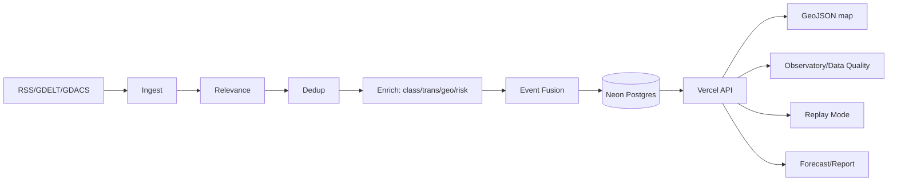

# Architecture

RiskMap is **event-centric**: an *article* is evidence; an *event* is the
real-world incident. Multiple reports of one incident fuse into one event with a
higher source count (and higher confidence), never into many map points.

## Layers

1. **Ingest** (`src/pipeline/ingest.py`, GitHub Actions) — RSS, GDELT (resilient
   fetch), GDACS. NewsAPI optional. Idempotent inserts.
2. **Relevance** (`src/core/relevance.py`) — word-boundary keyword scoring with a
   negative lexicon; off-topic news is filtered out.
3. **Dedup** (`src/core/dedup.py`) — canonical URL, normalized-title hash, token
   Jaccard, independent-domain counting (syndication collapses).
4. **Enrich** (`src/pipeline/enrich.py`) — classification, translation (originals
   preserved), geolocation, risk. Writes v2 columns.
5. **Fusion** (`src/core/events.py`) — semantic + spatiotemporal clustering into
   events; separate incidents stay separate.
6. **Geo** (`src/core/geo.py`) — precision tiers (exact/city/region/country) with
   `geo_confidence`, `geo_precision_m`, `geo_is_fallback`. No false precision.
7. **Risk** (`src/core/risk.py`) — Risk Engine v2. Risk (severity/exposure/
   vulnerability) is separate from confidence (evidence quality). Versioned.
8. **Serving** (`api/`) — Vercel serverless reads Neon Postgres.

## Observability

`pipeline_runs`, `provider_health`, `data_quality_snapshots` tables; endpoints
`/api/status` (freshness + deploy SHA), `/api/pipeline-runs`, `/api/data-quality`.

## Serverless function budget

Vercel Hobby caps a deployment at **12 Serverless Functions**. Multiple logical
endpoints therefore share one dispatcher (`api/v1.py`) routed by `?route=` via
`vercel.json` rewrites. See ADR-008.

## Diagram

